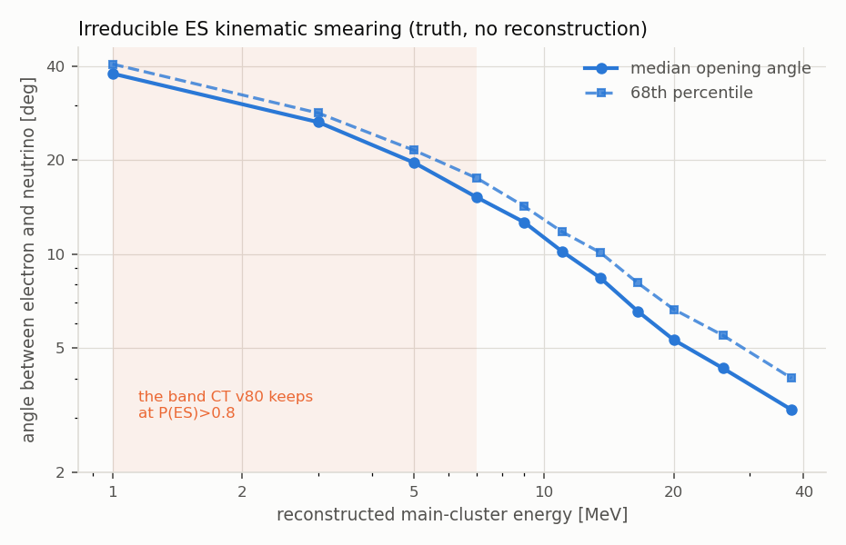
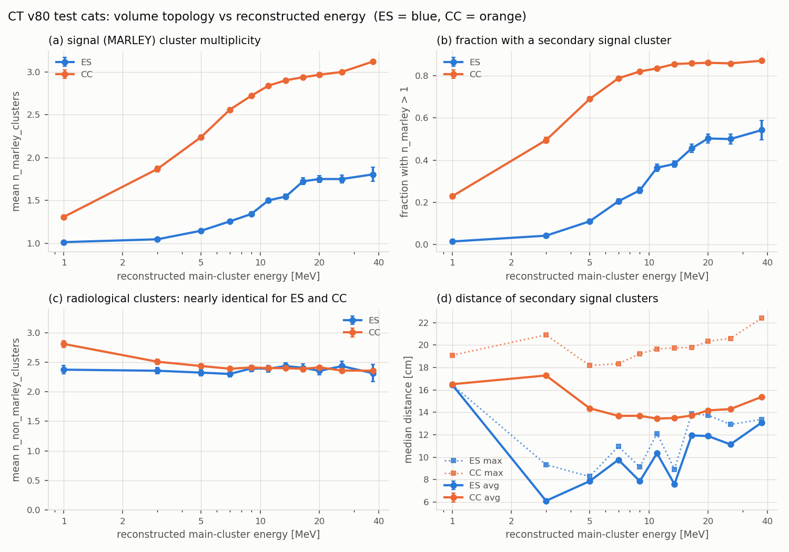
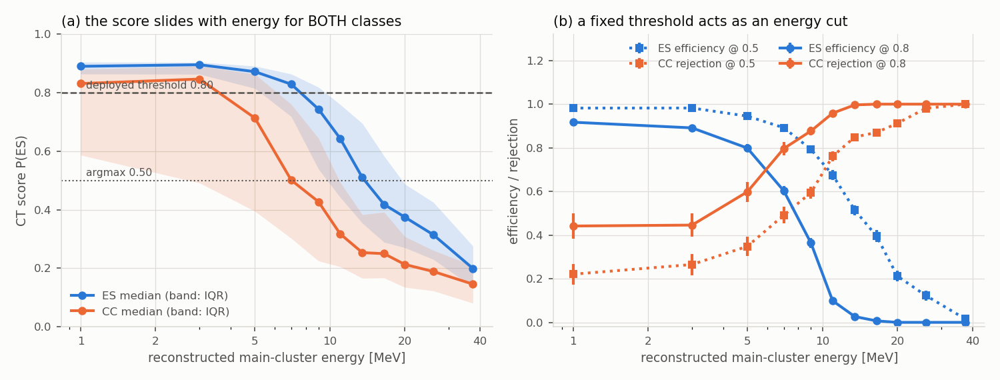
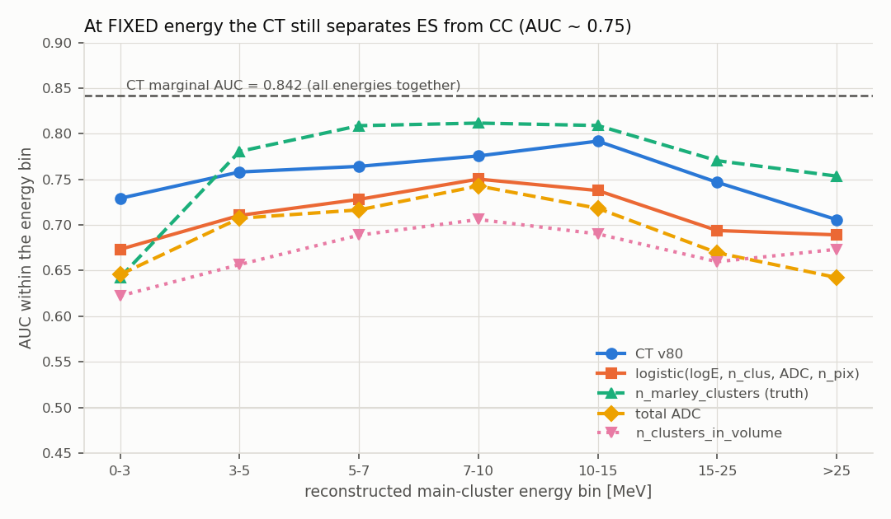
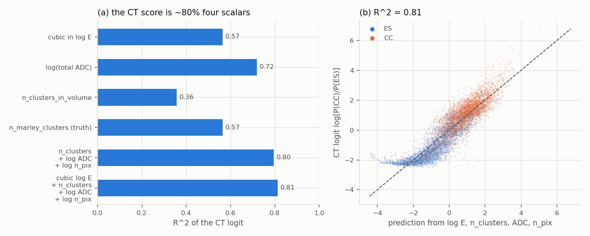
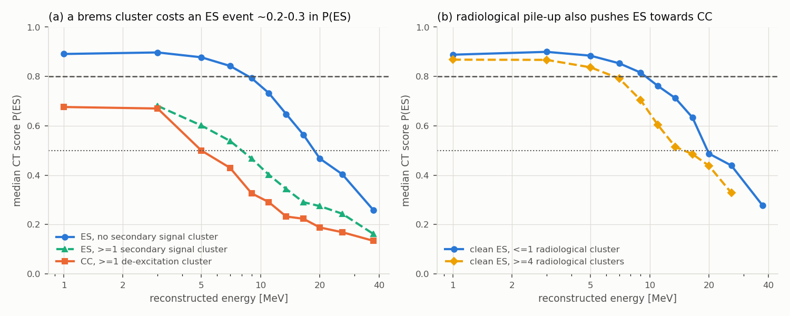
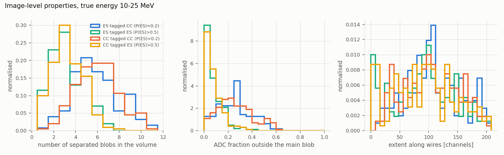
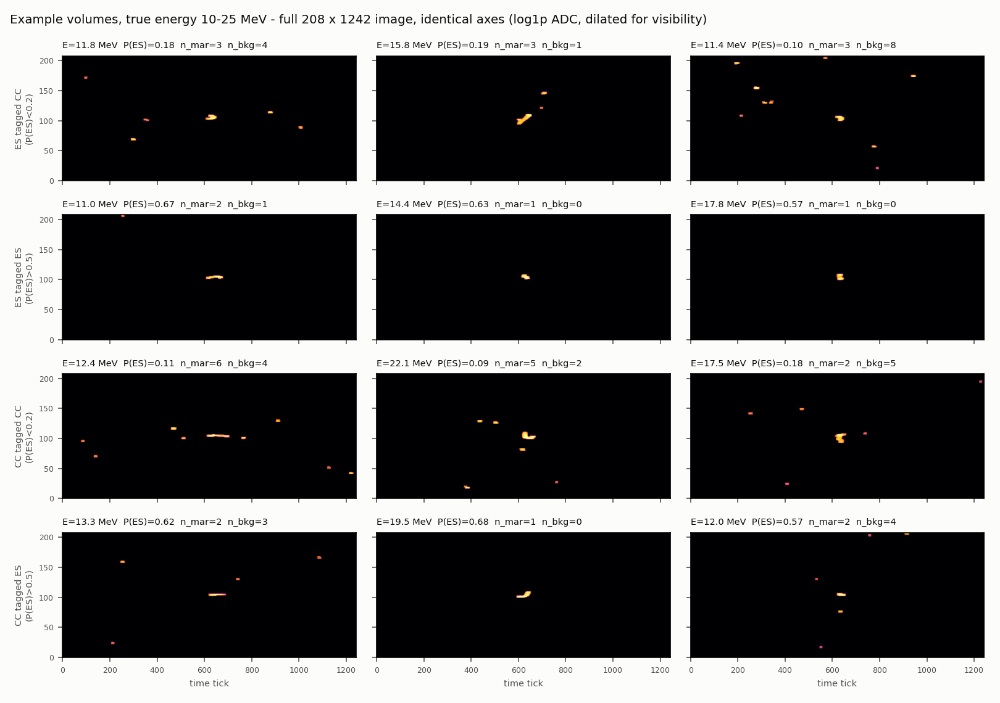
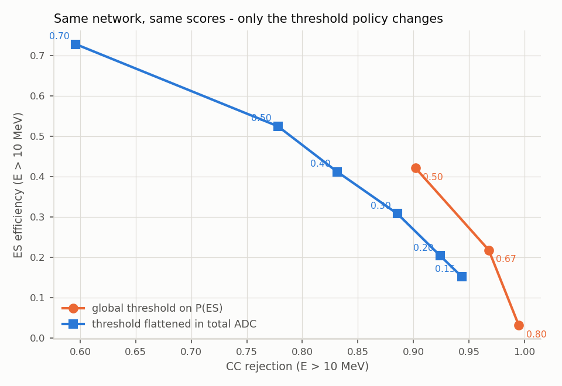

# CT v80: energy or topology? Why the deployed channel tagger throws away the events pointing needs

*Study of `ct_volume_v80_20260706_224935`, September 2026. Read-only; nothing in the
model or the samples was modified. All numbers come from the CT test cats
(597-621) and the balanced 4000 ES + 4000 CC test set the model itself was
evaluated on. Cats 1-399 and 623-1224 (held-out evaluation set) were not touched.*

---

## Executive summary

The starting observation is real and reproduces exactly: at the deployed threshold
`P(ES) > 0.80` the tagger keeps 91% of ES volumes below 3 MeV and 0.3% of ES
volumes between 15 and 25 MeV. That is backwards for pointing, because the ES
electron follows the neutrino to 33 degrees at 0-3 MeV but to 5.7 degrees at
15-25 MeV (Table 0). The deployed working point keeps **11.6% of the ES
directional information** in the sample.

What the data say about *why*:

1. **The CT is not purely an energy classifier - but its score is uncalibrated in
   energy, which is just as damaging.** At fixed energy the CT still separates the
   classes with AUC 0.71-0.79, essentially flat from 0 to 100 MeV (Table 3), versus
   a marginal AUC of 0.842. So genuine topological information is being used. The
   problem is that the score of *both* classes slides monotonically with energy
   (median `P(ES)` for ES: 0.89 -> 0.24; for CC: 0.84 -> 0.17 over the same range),
   so any global threshold degenerates into an energy cut.
2. **The dominant single driver is brightness, not shape.** `log(total ADC)` alone
   reaches AUC 0.803 of the CT's 0.842 and explains 72% of the variance of the CT
   logit; a 4-scalar logistic model (energy, cluster multiplicity, total ADC,
   number of hit pixels) reaches AUC 0.817 and explains 81% of the CT logit
   (Tables 4, 5; Fig. 4). The CT behaves mostly like a calorimeter with a
   multiplicity correction.
3. **The bremsstrahlung hypothesis is supported as a mechanism, and is the
   second-largest effect - but it is not the main cause.** Secondary MARLEY
   clusters in ES volumes do grow with energy exactly as the hypothesis predicts
   (2.7% of ES volumes below 3 MeV have one, 53% above 25 MeV; Table 1), and the CT
   punishes them hard: at 10-15 MeV the median `P(ES)` falls from 0.698 (no
   secondary cluster) to 0.376 (>=1 secondary cluster), and the effect survives
   controlling for total ADC as well as energy (Table 6, Fig. 5a). But even
   perfectly clean ES volumes with a single cluster are rejected at high energy -
   efficiency at 0.80 is 0.098 at 10-15 MeV and 0.005 at 15-25 MeV. **If
   bremsstrahlung were the only problem, clean ES would stay efficient. It does
   not.** Within ES, a smooth function of energy alone explains 60% of the CT logit
   variance; adding the secondary-cluster multiplicity adds 16 points.
4. **A third failure mode nobody asked about: radiological pile-up.** Non-MARLEY
   clusters are equally frequent in ES and CC volumes (2.37 vs 2.40 per volume,
   averaged over the test cats) and therefore carry essentially no class
   information, yet they push ES
   towards CC: clean ES at 10-15 MeV drops from median `P(ES)` 0.747 with <=1
   radiological cluster to 0.553 with >=4 (Table 7, Fig. 5b). This is pure
   inefficiency, and it makes CT performance depend on the radiological rate, which
   differs by a factor 3.6 between cat groups in the current samples (~2.4
   clusters/volume in every test cat, but ~0.66 in most of the validation cats).
5. **A free fix exists.** Making the threshold a function of an observable energy
   proxy, with no retraining and the same scores, recovers a factor 5 in
   high-energy ES efficiency at the same CC rejection as the deployed point
   (Table 8, Fig. 6).

A note on nomenclature that matters for interpretation: the metadata field
`particle_energy` used throughout this study (and by the v80 trainer) is **not** a
truth quantity. `create_volumes.py` fills it with `reco_energy_mev` of the main
cluster, i.e. the main-cluster ADC integral divided by a calibration constant
(`particle_energy == cluster_energy` for every volume in the sample, which is the
giveaway). It is an *observable*, available online. That is convenient - it means
the energy-flattening fix below can be implemented exactly rather than through a
proxy - but statements like "efficiency versus true energy" should read
"efficiency versus reconstructed main-cluster energy". The ES electron-neutrino
opening angles in Table 0 are truth (they use `true_mom_*` and
`true_neutrino_mom_*`); only the binning variable is reconstructed.

---

## 1. Provenance: how the CT scores were joined to the volume metadata

`test_predictions.npz` stores `predictions`, `true_labels`, `energies` and the
standardized `aux_features`, but no pointer back to the source volume, so the
scores could not be related to topology. They can be recovered exactly.
`train_ct_volume_v80.py` drives every shuffle from one `RandomState(42)` and
consumes it in a fixed order (train ES files, train CC files, train permutation;
then val; then test), and `RandomState.shuffle` consumes an amount of randomness
that depends only on the list length. Replaying that stream with the current file
counts reproduces the exact `(file, index)` of all 8000 test volumes.

Four independent checks confirm the join:

| check | result |
|---|---|
| reconstructed labels vs `true_labels` | 8000/8000 identical |
| reconstructed `particle_energy` vs stored `energies` | 8000/8000 bit-identical |
| `n_clusters_in_volume` from metadata vs de-standardized `aux_features[:,0]` | max abs difference 0.0000 |
| model re-run on 24 joined volumes vs stored `P(ES)` | max abs difference 5.4e-4 (float16 storage of the training images) |

The quoted efficiencies reproduce exactly (ES efficiency at `P(ES)>0.8`: 0.908,
0.864, 0.696, 0.435, 0.060, 0.003, 0.000 in the seven energy bins), so the joined
table is the same data the deployed numbers came from.

Two incidental facts worth recording: cats 597, 599 and 621 have no volume
directory, so "test cats 597-621" is 22 cats; and the natural ES:CC ratio of
volumes in those cats is 7923:77102 = **1:9.7**, whereas the CT was trained and is
evaluated on a 1:1 mixture. Efficiency and rejection are prior-independent, but
any accuracy-like number is not.

---

## 2. Why high energy is what pointing needs



The ES electron does not remember the neutrino direction perfectly: the recoil
opening angle is set by kinematics and shrinks with energy. Using the truth
momenta stored in the volume metadata:

### Table 0 - intrinsic ES kinematics (truth angles, reco-energy bins)

| E [MeV] | N(ES) | median angle(e-, nu) [deg] | 68% angle [deg] | relative pointing information per event |
|---|---|---|---|---|
| 0-3 | 520 | 32.7 | 36.5 | 1.0x |
| 3-5 | 506 | 22.8 | 24.5 | 2.2x |
| 5-7 | 514 | 17.5 | 19.2 | 3.6x |
| 7-10 | 704 | 13.2 | 14.9 | 6.0x |
| 10-15 | 915 | 9.2 | 10.9 | 11.2x |
| 15-25 | 695 | 5.7 | 7.1 | 26.2x |
| >25 | 146 | 3.5 | 4.6 | 62.1x |

The last column is `1/theta68^2`, the relative Fisher information a single event
contributes to a direction fit, normalised to the lowest bin. One 20 MeV ES
electron is worth about 26 events at 1-3 MeV *before* any reconstruction
resolution is folded in. This is the yardstick used in Table 8: "ES pointing
information kept" is the fraction of `sum(1/theta68^2)` over ES volumes that
survives a selection.

The deployed tagger keeps the 0-7 MeV band almost intact and removes nearly
everything above 10 MeV, i.e. it is close to an anti-selection on pointing power.

---

## 3. Q1 - how topology depends on energy, for ES and for CC



### Table 1 - truth-level volume topology vs reconstructed energy (test cats 597-621, all 85 025 volumes)

| E [MeV] | N(ES) | n_clus ES | n_marley ES | n_nonmarley ES | f(n_mar>1) ES | med d_avg ES [cm] | N(CC) | n_clus CC | n_marley CC | n_nonmarley CC | f(n_mar>1) CC | med d_avg CC [cm] |
|---|---|---|---|---|---|---|---|---|---|---|---|---|
| 0-3 | 1003 | 3.42 | 1.03 | 2.39 | 0.027 | 10.4 | 1953 | 4.17 | 1.46 | 2.71 | 0.302 | 16.9 |
| 3-5 | 1037 | 3.44 | 1.09 | 2.35 | 0.072 | 8.1 | 1644 | 4.56 | 2.08 | 2.47 | 0.613 | 15.3 |
| 5-7 | 999 | 3.47 | 1.21 | 2.26 | 0.155 | 9.3 | 2667 | 4.83 | 2.42 | 2.41 | 0.751 | 14.1 |
| 7-10 | 1387 | 3.68 | 1.31 | 2.37 | 0.242 | 8.0 | 7155 | 5.09 | 2.69 | 2.40 | 0.813 | 13.6 |
| 10-15 | 1803 | 3.94 | 1.53 | 2.41 | 0.374 | 8.7 | 18526 | 5.28 | 2.88 | 2.40 | 0.848 | 13.5 |
| 15-25 | 1409 | 4.12 | 1.73 | 2.39 | 0.478 | 11.6 | 30628 | 5.35 | 2.96 | 2.39 | 0.860 | 14.0 |
| >25 | 285 | 4.18 | 1.80 | 2.38 | 0.533 | 12.6 | 14529 | 5.42 | 3.06 | 2.36 | 0.863 | 15.0 |

**The brems prediction is confirmed at truth level.** ES volumes acquire secondary
signal clusters as the electron gets more energetic: the mean MARLEY-cluster
multiplicity rises from 1.03 to 1.80 and the fraction of ES volumes with at least
one companion cluster rises from 2.7% to 53%. A 10-20 MeV electron in liquid argon
(X0 = 14 cm, critical energy ~32 MeV) radiates a non-negligible fraction of its
energy, and the photons convert far enough away to be clustered separately - the
median companion distance, 8-13 cm, is well beyond the range of the electron
itself (~5 cm at 10 MeV), so these are genuinely displaced deposits, not fragments
of the primary track.

**But CC is always ahead at the same energy.** CC de-excitation gamma multiplicity
saturates near 3 clusters above 10 MeV, while ES reaches only 1.8 at the very top
of the spectrum. At 10-15 MeV, 84.8% of CC volumes have a companion cluster
against 37.4% of ES volumes. The topological difference narrows with energy but
never closes, which is exactly why the conditional AUC in Section 4 stays around
0.75-0.79 rather than collapsing to 0.5.

The companion-cluster *distances* tell the same story: ES companions sit closer to
the main track (8-9 cm at 5-10 MeV) than CC de-excitation gammas (13-14 cm), but
the two converge at high energy (12.6 vs 15.0 cm above 25 MeV) as the radiated
photons get harder and travel further. So high-energy ES really does start to look
like CC, morphologically.

**A result nobody was looking for:** `n_non_marley_clusters` - radiological blips
that happen to fall in the 100 cm volume - averages 2.37 for ES and 2.40 for CC
and is flat in energy above ~5 MeV (the one visible excess is CC at 0-3 MeV, a
small and atypical sample). It carries essentially no class information.
Section 5 shows the CT reacts to it anyway.

---

## 4. Q2 - what the CT score is actually a function of

### (a) The score slides with energy for both classes



### Table 2 - CT score and working points vs reconstructed energy (balanced test set)

| E [MeV] | N(ES) | median P(ES) ES | eff(ES) @0.5 | eff(ES) @0.8 | N(CC) | median P(ES) CC | rej(CC) @0.5 | rej(CC) @0.8 |
|---|---|---|---|---|---|---|---|---|
| 0-3 | 520 | 0.894 | 0.988 | 0.908 | 119 | 0.844 | 0.227 | 0.429 |
| 3-5 | 506 | 0.890 | 0.962 | 0.864 | 83 | 0.780 | 0.289 | 0.542 |
| 5-7 | 514 | 0.853 | 0.916 | 0.696 | 152 | 0.588 | 0.421 | 0.711 |
| 7-10 | 704 | 0.776 | 0.825 | 0.435 | 386 | 0.444 | 0.580 | 0.858 |
| 10-15 | 915 | 0.570 | 0.589 | 0.060 | 955 | 0.275 | 0.816 | 0.982 |
| 15-25 | 695 | 0.389 | 0.283 | 0.003 | 1559 | 0.219 | 0.910 | 1.000 |
| >25 | 146 | 0.239 | 0.034 | 0.000 | 746 | 0.166 | 0.995 | 1.000 |

The key observation is in the two "median P(ES)" columns. It is not that ES events
move and CC events stay put; **both** distributions slide down together by roughly
the same amount. The gap between them - the actual discrimination - is roughly
preserved. What is lost is the *calibration*: `P(ES) = 0.8` means "a typical ES
event" at 3 MeV and "a very unusual event" at 15 MeV. A fixed threshold therefore
integrates the class separation and the energy dependence into one cut, and the
energy dependence wins.

### (b) At fixed energy the CT still works



### Table 3 - conditional AUC in bins of reconstructed energy (0.5 = no separation)

| E [MeV] | N(ES) | N(CC) | CT v80 | n_clusters | total ADC | n_marley (truth) | logistic(logE, n_clus, ADC, n_pix) |
|---|---|---|---|---|---|---|---|
| 0-3 | 520 | 119 | 0.729 | 0.622 | 0.646 | 0.643 | 0.673 |
| 3-5 | 506 | 83 | 0.758 | 0.657 | 0.707 | 0.781 | 0.710 |
| 5-7 | 514 | 152 | 0.764 | 0.689 | 0.717 | 0.809 | 0.728 |
| 7-10 | 704 | 386 | 0.776 | 0.706 | 0.743 | 0.812 | 0.750 |
| 10-15 | 915 | 955 | 0.792 | 0.690 | 0.718 | 0.809 | 0.738 |
| 15-25 | 695 | 1559 | 0.747 | 0.660 | 0.670 | 0.770 | 0.694 |
| >25 | 146 | 746 | 0.706 | 0.673 | 0.642 | 0.754 | 0.689 |
| **all (marginal)** | 4000 | 4000 | **0.842** | 0.706 | 0.803 | 0.826 | 0.817 |

**This is the decisive test and it exonerates the network, partially.** A pure
energy classifier would have conditional AUC = 0.5 in every row. The CT has
0.71-0.79, roughly flat, and it beats every single observable in every bin. The
marginal AUC of 0.842 is higher than any conditional value only because the
class-vs-energy correlation adds separation on top.

Conditioning on the whole-volume total ADC instead of the main-cluster energy
gives a lower but still clearly non-trivial residual:

### Table 3b - conditional AUC in deciles of total ADC

| total ADC range | N(ES) | N(CC) | CT v80 | n_clusters | n_marley (truth) |
|---|---|---|---|---|---|
| 393-23423 | 999 | 144 | 0.665 | 0.569 | 0.628 |
| 23423-39136 | 909 | 234 | 0.715 | 0.617 | 0.748 |
| 39136-55351 | 732 | 411 | 0.696 | 0.604 | 0.755 |
| 55351-72487 | 538 | 604 | 0.716 | 0.616 | 0.727 |
| 72487-92822 | 413 | 730 | 0.718 | 0.636 | 0.743 |
| 92822-119409 | 259 | 884 | 0.703 | 0.613 | 0.725 |
| 119409-389257 | 150 | 993 | 0.709 | 0.636 | 0.738 |

So: **around 0.70-0.79 of usable, energy-independent discrimination exists inside
the network**, and it is currently entangled with a much cruder energy response.

### (c) How much of the decision is energy, and how much is topology?

### Table 4 - simple models of the LABEL, fitted on the test set

| model | AUC | deviance explained | (AUC-0.5) relative to CT |
|---|---|---|---|
| label ~ log E | 0.7579 | 0.137 | 0.75 |
| label ~ log E + (log E)^2 | 0.7586 | 0.154 | 0.76 |
| label ~ n_clusters_in_volume | 0.7064 | 0.100 | 0.60 |
| label ~ log(total ADC) | 0.8033 | 0.208 | 0.89 |
| label ~ log E + n_clusters | 0.7973 | 0.198 | 0.87 |
| label ~ log E + n_clusters + log ADC + log n_pix | 0.8173 | 0.235 | 0.93 |
| label ~ n_marley_clusters (TRUTH, not available online) | 0.8255 | 0.283 | 0.95 |
| **CT v80 (the CNN itself)** | **0.8418** | **0.283** | 1.00 |

### Table 5 - variance of the CT logit log[P(CC)/P(ES)] explained by simple variables (R^2)

| regressors | all | ES only | CC only |
|---|---|---|---|
| cubic in log E | 0.565 | 0.598 | 0.339 |
| log(total ADC) | 0.719 | 0.670 | 0.601 |
| n_clusters_in_volume | 0.356 | 0.188 | 0.338 |
| n_marley_clusters (truth) | 0.565 | 0.403 | 0.487 |
| n_clusters + log ADC + log n_pix | 0.795 | 0.725 | 0.737 |
| cubic log E + n_clusters + log ADC + log n_pix | 0.813 | 0.761 | 0.748 |



Reading these two tables together:

- **Energy alone captures 75% of the CT's AUC gain** (0.258 of 0.342 above chance)
  and 48% of its deviance. So "energy classifier" is a fair first-order description
  of the *decision*, even though it is not a complete description of the
  *information*.
- **Total ADC is a better single description than energy**: AUC 0.803 (89% of the
  CT gain), 72% of the logit variance. This makes sense mechanically. The v80
  images are `log1p(raw ADC)` with no per-image normalization, so the absolute
  brightness of the picture is a direct input feature, and the main-cluster energy
  is *defined* as the main-cluster ADC integral over a calibration constant
  (log-log correlation between `particle_energy` and total volume ADC: 0.93).
  The network did not have to learn anything subtle to get most of its AUC.
- **Four scalars reproduce 81% of the CT logit** and 93% of its AUC gain. Whatever
  else the CNN has learned lives in the remaining 19% of the score variance - which
  is the part that produces the conditional AUC of Table 3, and is genuinely
  useful.

The v80 design note explicitly chose to drop per-image normalization because "the
absolute amplitude scale correlates with deposited energy (a real ES/CC
discriminator)". That reasoning is correct for accuracy and wrong for pointing:
the amplitude scale is exactly the shortcut that makes the score energy-dependent.

---

## 5. Q3 - the bremsstrahlung test and the misclassifications



### Table 6 - ES events at fixed energy, split by secondary signal-cluster multiplicity

| E [MeV] | N(n_mar=1) | med P(ES) | eff@0.5 | eff@0.8 | N(n_mar>1) | med P(ES) | eff@0.5 | eff@0.8 | AUC(P(ES) tells them apart) |
|---|---|---|---|---|---|---|---|---|---|
| 0-3 | 505 | 0.895 | 0.994 | 0.919 | 15 | 0.813 | 0.800 | 0.533 | 0.809 |
| 3-5 | 466 | 0.892 | 0.985 | 0.899 | 40 | 0.765 | 0.700 | 0.450 | 0.848 |
| 5-7 | 437 | 0.863 | 0.979 | 0.785 | 77 | 0.534 | 0.558 | 0.195 | 0.889 |
| 7-10 | 533 | 0.810 | 0.938 | 0.561 | 171 | 0.495 | 0.474 | 0.041 | 0.884 |
| 10-15 | 564 | 0.698 | 0.810 | 0.098 | 351 | 0.376 | 0.234 | 0.000 | 0.866 |
| 15-25 | 366 | 0.490 | 0.478 | 0.005 | 329 | 0.276 | 0.067 | 0.000 | 0.857 |
| >25 | 70 | 0.307 | 0.057 | 0.000 | 76 | 0.197 | 0.013 | 0.000 | 0.767 |

**The hypothesis is right about the mechanism.** At every energy, an ES volume
containing a bremsstrahlung companion is scored dramatically more CC-like: the
last column says that within a single energy bin, `P(ES)` alone identifies which
ES events have a companion cluster with AUC 0.77-0.89. Figure 5a makes the point
visually - the "ES with a companion" curve sits between the clean-ES curve and the
CC curve, and at high energy it is nearly on top of the CC curve. That is the
confusion the hypothesis predicted.

The effect is not a disguised energy or brightness effect. Splitting the 10-15 MeV
and 15-25 MeV ES samples into total-ADC terciles and comparing at fixed energy
*and* fixed ADC:

| E [MeV] | total ADC tercile | N(n_mar=1) | med P(ES) | N(n_mar>1) | med P(ES) | AUC |
|---|---|---|---|---|---|---|
| 10-15 | 32784-50103 | 265 | 0.742 | 40 | 0.594 | 0.769 |
| 10-15 | 50103-60656 | 220 | 0.633 | 85 | 0.423 | 0.805 |
| 10-15 | 60656-135037 | 79 | 0.511 | 225 | 0.322 | 0.792 |
| 15-25 | 47532-76054 | 179 | 0.556 | 53 | 0.394 | 0.779 |
| 15-25 | 76054-92309 | 125 | 0.452 | 106 | 0.310 | 0.780 |
| 15-25 | 92309-220115 | 62 | 0.433 | 169 | 0.230 | 0.883 |

**But the hypothesis is not the main cause of the high-energy collapse.** Look at
the `eff@0.8` column for `n_mar = 1` in Table 6: clean, single-cluster ES volumes
with no bremsstrahlung companion at all are kept with efficiency 0.098 at
10-15 MeV and 0.005 at 15-25 MeV. Removing the brems confusion entirely would
leave the vast majority of high-energy ES still rejected. Quantitatively, within
the ES sample:

| regressors (ES only) | R^2 of CT logit | increment |
|---|---|---|
| cubic in log E | 0.598 | - |
| + n_marley_clusters | 0.755 | +0.157 (brems) |
| + n_non_marley_clusters | 0.790 | +0.035 (radiologicals) |
| + log(total ADC) | 0.809 | +0.019 |

So the ranking of causes for the loss of high-energy ES is: **energy/brightness
first (~60% of the score variance), bremsstrahlung companions second (~16%),
radiological pile-up third (~3.5%)**. (These are not orthogonal - multiplicity
itself grows with energy - but the ordering is robust: reversing the order,
`n_marley` alone gives R^2 = 0.403 and energy adds 0.352 on top.)

### Table 7 - radiological clusters, which carry no class information at all (clean ES only)

| E [MeV] | N(n_nonmar<=1) | med P(ES) | eff@0.5 | N(n_nonmar>=4) | med P(ES) | eff@0.5 |
|---|---|---|---|---|---|---|
| 0-3 | 166 | 0.897 | 1.000 | 120 | 0.867 | 0.975 |
| 3-5 | 158 | 0.895 | 1.000 | 88 | 0.858 | 0.932 |
| 5-7 | 143 | 0.870 | 1.000 | 102 | 0.806 | 0.931 |
| 7-10 | 188 | 0.822 | 0.989 | 125 | 0.746 | 0.832 |
| 10-15 | 188 | 0.747 | 0.952 | 138 | 0.553 | 0.616 |
| 15-25 | 116 | 0.570 | 0.655 | 98 | 0.430 | 0.327 |

The CT counts blips without asking where they came from. Since radiological
multiplicity is identical for the two classes (Table 1), every bit of this
response is pure efficiency loss, and it couples CT performance to the
radiological rate of the sample. In the current burst samples that rate is not
even constant: every test cat (597-621) sits at ~2.4 non-MARLEY clusters per
volume, but the validation range is bimodal - cats 572-579, 592 and 595 are at
~2.4 while cats 580-591, 593, 594 and 596 are at ~0.66, a factor 3.6 lower. A
model tuned at one rate will not behave the same at the other, and any scenario
comparison that mixes cat ranges will confound the two effects.

### What the misclassified events actually look like



### Table 9 - image-level comparison, reconstructed energy 10-25 MeV (up to 200 volumes sampled per category)

| category | N | med E [MeV] | med P(ES) | med n_clus | med n_marley | med n_nonmarley | med total ADC | med n_pix | med wire extent | med tick extent | med n blobs | med ADC fraction outside main blob |
|---|---|---|---|---|---|---|---|---|---|---|---|---|
| ES tagged CC (P(ES)<0.2) | 126 | 16.9 | 0.155 | 6.0 | 3.0 | 3.0 | 104719 | 304 | 104 | 702 | 6 | 0.255 |
| ES tagged ES (P(ES)>0.5) | 200 | 12.7 | 0.659 | 3.0 | 1.0 | 2.0 | 54627 | 152 | 91 | 511 | 3 | 0.056 |
| CC tagged CC (P(ES)<0.2) | 200 | 17.8 | 0.136 | 7.0 | 4.0 | 3.0 | 105721 | 306 | 103 | 650 | 6 | 0.240 |
| CC tagged ES (P(ES)>0.5) | 200 | 13.8 | 0.611 | 3.0 | 1.0 | 2.0 | 58205 | 154 | 92 | 519 | 3 | 0.061 |

("blobs" = connected components after a 3x3 dilation of the nonzero pixels; "ADC
fraction outside the main blob" = charge not in the largest component.)

**The rows pair up by tag, not by truth.** An ES volume tagged CC and a CC volume
tagged CC are, on every image observable, the same object: 6-7 clusters, ~105k
total ADC, ~305 hit pixels, 6 blobs, a quarter of the charge outside the main
blob. An ES volume tagged ES and a CC volume tagged ES are likewise
indistinguishable: 3 clusters, ~56k ADC, ~153 pixels, 3 blobs, 6% of the charge
outside the main blob. The wire extent barely separates anything (91-104
channels in all four categories); the tick extent and the blob count do.

This is the strongest statement in the study, and it cuts both ways. The CT is
*not* making arbitrary mistakes - it is reading a real observable (how much of the
charge is dispersed into satellite deposits) and the high-energy ES events that it
gets wrong are the ones that genuinely look like CC. The user's hypothesis is
vindicated at the image level: an ES electron that radiated has the same picture
as a CC electron with de-excitation gammas. Conversely, the CC events that slip
through are the ones whose gammas were not resolved.



The examples are all shown on identical axes (the full 208 x 1242 volume) so the
categories can be compared directly: rows 1 and 3 (both tagged CC, one ES one CC)
look alike, as do rows 2 and 4 (both tagged ES). The second panel of row 1 is the
textbook brems picture - a 15.8 MeV ES electron with two companion deposits a few
tens of ticks away, scored `P(ES) = 0.19`.

---

## 6. The working point: a free factor 5 without retraining



### Table 8 - working points. "E>10 MeV" is the sample that carries the pointing power

| selection | ES eff (all) | CC rej (all) | ES eff (E>10) | CC rej (E>10) | ES pointing information kept |
|---|---|---|---|---|---|
| global P(ES) > 0.5 | 0.699 | 0.820 | 0.422 | 0.902 | 0.405 |
| global P(ES) > 0.668 | 0.563 | 0.899 | 0.219 | 0.968 | 0.240 |
| **global P(ES) > 0.8 (deployed)** | **0.407** | **0.945** | **0.032** | **0.995** | **0.116** |
| per-ADC-decile threshold, ES eff 0.70/decile | 0.697 | 0.608 | 0.729 | 0.596 | 0.731 |
| per-ADC-decile threshold, ES eff 0.50/decile | 0.501 | 0.778 | 0.526 | 0.778 | 0.532 |
| per-ADC-decile threshold, ES eff 0.40/decile | 0.400 | 0.830 | 0.413 | 0.831 | 0.421 |
| per-ADC-decile threshold, ES eff 0.30/decile | 0.301 | 0.883 | 0.309 | 0.886 | 0.314 |
| per-ADC-decile threshold, ES eff 0.20/decile | 0.200 | 0.920 | 0.205 | 0.924 | 0.210 |
| per-ADC-decile threshold, ES eff 0.15/decile | 0.151 | 0.942 | 0.153 | 0.944 | 0.161 |

The per-decile thresholds are derived on one half of the test bursts (alternating
cats) and applied to the other half, so they are not tuned on the events they
select. Nothing about the network changes - these are the same 8000 scores, cut
differently.

Two comparisons matter.

- **At matched overall CC rejection.** Against the deployed point (CC rejection
  0.945), the ADC-flattened policy at the matching rejection keeps
  0.161 of the ES pointing information versus 0.116, and
  0.153 of high-energy ES versus 0.032. At CC rejection ~0.89 the
  comparison is 0.314 versus about 0.26 by interpolation of the global-threshold
  curve.
- **The shape of the selected sample changes completely.** The flattened policy
  produces an ES efficiency that is the same at every energy (0.309 above 10 MeV
  versus 0.301 overall) instead of one that falls by two orders of magnitude, and a
  CC contamination that is spread over energy instead of piled up at low energy.

This is a real but bounded gain: because the score is heavily energy-dependent,
flattening in energy discards low-energy ES that the global threshold kept. The
comparison is favourable only when measured against pointing power, which is the
right metric, and it is *strongly* favourable at tight working points, which is
where a 1:9.7 ES:CC prior forces you to operate.

---

## 7. Q4 - what would help, ranked

**1. Stop cutting at a fixed number, or cut at an energy-dependent one.
(No retraining, hours of work, immediate.)**
The single most damaging property of the deployed system is that a
class-conditional score is compared to an energy-independent constant. Two
variants, in increasing order of ambition:
(a) replace `channel_tagger_threshold: 0.8` with a threshold table in bins of the
main-cluster reconstructed energy (already in the metadata, computed online) or of
total volume ADC, calibrated to a target ES efficiency per bin;
(b) better, do not cut at all - carry `P(ES)` into the directional fit as a
per-event weight, together with the per-event kinematic weight of Table 0. A soft
weight has no threshold to be miscalibrated, and it lets a 20 MeV event with
`P(ES) = 0.45` still contribute the 26x directional information it carries.
*Mechanism*: removes the energy dependence of the operating point without touching
the discriminant. *Expected*: Table 8 - at the deployed CC rejection (0.945) the
flattened policy keeps 0.161 of the ES pointing information instead of 0.116
(+39%) and 15.3% of the E>10 MeV ES instead of 3.2% (a factor 4.8); more if the
score is used as a weight rather than a cut.

**2. Retrain with the two classes reweighted to a common energy spectrum.
(One training, config-level change.)**
The network currently earns 75% of its AUC from `P(CC | E)`, which is free
information in a 1:1 mixture with different spectra. Give every ES and CC event a
weight such that the two energy (or total-ADC) distributions coincide, and that
information disappears from the loss; the capacity has to go into the residual
0.71-0.79 of Table 3. *Mechanism*: kills the shortcut at the source, so a single
global threshold becomes approximately energy-flat by construction. *Expected*:
marginal AUC drops from 0.842 towards ~0.78, and that is the *point* - the
efficiency becomes uniform in energy. Reweighting is strictly preferable to an
adversarial/pivot term (DisCo, MoDe) as a first attempt: one line of `sample_weight`
versus a second network and a tuning knob, and the pivot only becomes worth it if
reweighting leaves residual sculpting.

**3. Take the absolute brightness away from the image and hand it over
explicitly. (One training.)**
Normalize each image (per-image max or per-image sum) so the CNN cannot read the
calorimetric scale off the pixels, and feed `log(total ADC)`, `log(n_pix)` and the
main-cluster energy as auxiliary scalars - the `volume_v80_aux.json` branch already
exists. Note this inverts the v80 design decision, deliberately: v79's
per-image normalization was judged a mistake because it lowered accuracy, but
accuracy is not the objective. *Mechanism*: forces the convolutional part to learn
shape, and makes the energy dependence explicit and therefore controllable (it can
be regularised, decorrelated, or simply removed from the head). *Caveat*: on its
own this only relocates the shortcut - do it together with (2). *Expected*: little
change in marginal AUC, much better behaved conditional efficiency; also makes the
model robust to gain/calibration shifts, which the current model is not.

**4. Remove the radiological clusters the CT is reacting to. (Data-level, cheap
to test.)**
Table 7 shows a pure loss: >=4 radiological blips cost a clean 10-15 MeV ES event
0.19 in median `P(ES)`, for zero discriminating power. Options: mask clusters that
fail a time/space association with the main track before rendering the image, or
render a two-channel image (main-track-associated charge, everything else). Do not
simply crop tightly around the main track - that would also delete the CC
de-excitation gammas at 13-14 cm, which are the actual signal for the classifier;
a crop should be at least ~30-40 cm in radius, and the distance distributions in
Table 1 should be used to set it. *Mechanism*: raises the signal-to-noise of the
multiplicity feature the CT is already using, and decouples performance from the
radiological rate (which varies by 3.6x across the current cat ranges - a
robustness problem in its own right). *Expected*: recovers most of the 0.19 median
score loss for high-multiplicity-background ES; unlike (1)-(3) it should raise the
conditional AUC as well.

**5. Three-plane input (v82) before point clouds (v81). (Existing code, never
evaluated.)**
The single X-plane projection merges deposits that are separated in the other
views, so some of the ES/CC topological difference is projected away; that is a
plausible part of why the conditional AUC stalls at ~0.78 while the truth
multiplicity reaches 0.81. `train_ct_three_plane_volumes_v82.py` exists and has
never been run to completion on the burst-sample volumes. *Mechanism*: recovers
genuine 3D separation between a displaced gamma cluster and an overlapping
projection. *Expected*: a few points of conditional AUC at best - it does nothing
about the energy shortcut, so it must be combined with (2). Rank it after (1)-(4)
because it is the most work for the least certain gain.
`train_ct_points_v81.py` (DeepSets over nonzero pixels) is worth running mainly as
a cheap ablation: a point cloud of `(channel, tick, log ADC)` triplets carries the
multiplicity and spatial structure but almost no image-scale information, so
comparing v81 to v80 measures directly how much the CNN gains from raw brightness.

**6. Change the metric before changing the model.**
Every number in `results.json` (accuracy 0.759, AUC 0.842) is computed on a 1:1
mixture with the natural rate being 1:9.7, and none of them is sensitive to the
fact that the selected ES sample has almost no directional information. Adopt
"fraction of ES pointing information retained at fixed CC contamination"
(the last column of Table 8) as the headline number for CT work. Under that
metric the current model at its deployed threshold scores 0.116, and the
same model with a different threshold policy scores 0.161.

---

## 8. Caveats

- `particle_energy` is a *reconstructed* main-cluster energy, not truth (Section 1).
  All "vs energy" statements are therefore vs an observable, which is what makes
  recommendation 1 implementable, but it also means the conditional-AUC test of
  Table 3 conditions on something correlated with the CT's own dominant input.
  Table 3b, which conditions on total ADC, is the more conservative version and
  still gives 0.67-0.72.
- Everything is measured on 22 cats (597-621) with a single radiological rate.
  Cats 572-596 contain a mixture of two rates; that difference should be
  understood before any of these numbers are transported.
- The comparison in Table 8 uses per-decile thresholds derived on half the test
  bursts. With ~400 ES events per decile per half, the threshold statistical
  uncertainty is a few percent in efficiency - enough to move individual rows
  slightly, not enough to change the conclusion.
- `n_marley_clusters` is truth information used here for diagnosis only; it is not
  available online and none of the recommendations depend on having it.
- No statement is made here about how any of this propagates to a final pointing
  resolution: that requires running the snop-pipeline scenarios, which was out of
  scope and must be done on cats 1-399 or 623-1224 with a v80 model.

---

## 9. Reproducing

```bash
source scripts/init.sh          # LCG_106_cuda view

# 1. join the CT test scores to the full volume metadata (~3 s)
python3 channel_tagging/ana/ct_v80_build_test_join.py --out-dir $WORK

# 2. truth-level topology scan of every volume in the test cats (~2 min)
python3 channel_tagging/ana/ct_v80_truth_scan.py \
        --cat-lo 597 --cat-hi 621 --out $WORK/truth_scan_test.npz

# 3. all tables and figures (~25 min; the image step dominates)
python3 channel_tagging/ana/ct_v80_energy_topology.py \
        --join $WORK/ct_v80_test_join.npz \
        --truth-scan $WORK/truth_scan_test.npz \
        --figdir docs/figures/ct_v80_study \
        --tables $WORK/tables.md
```

`ct_v80_build_test_join.py` aborts if the replayed selection does not match
`test_predictions.npz` exactly, so it will fail loudly rather than silently
mis-associate if the sample directories ever change.

| file | what it is |
|---|---|
| `channel_tagging/ana/ct_v80_build_test_join.py` | replays the v80 test-set selection, joins scores to metadata |
| `channel_tagging/ana/ct_v80_truth_scan.py` | metadata-only scan of a cat range |
| `channel_tagging/ana/ct_v80_energy_topology.py` | all tables and figures in this note |
| `docs/figures/ct_v80_study/` | the nine figures |
