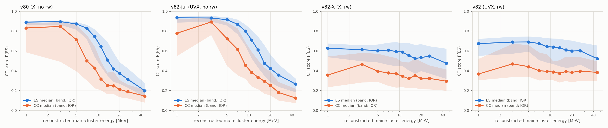
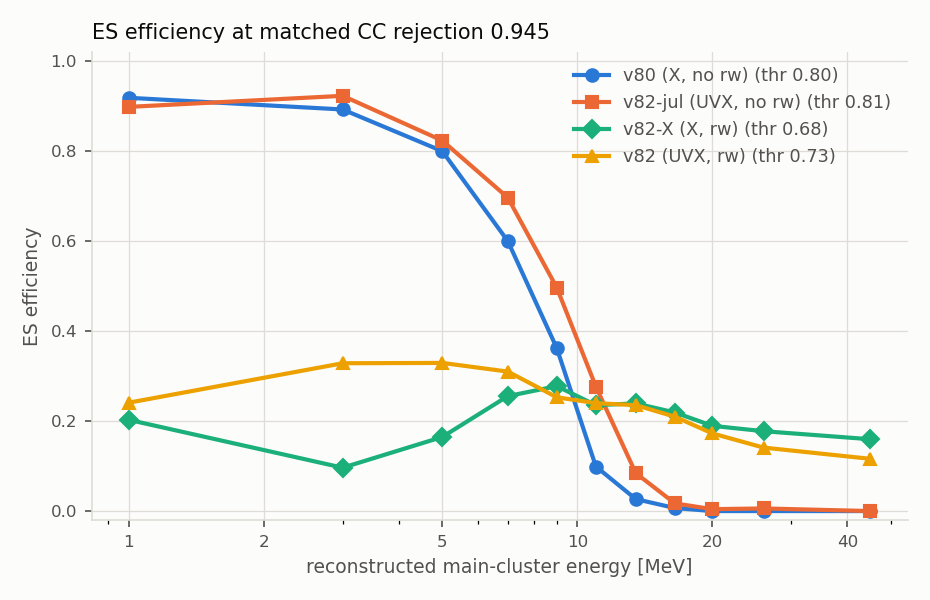
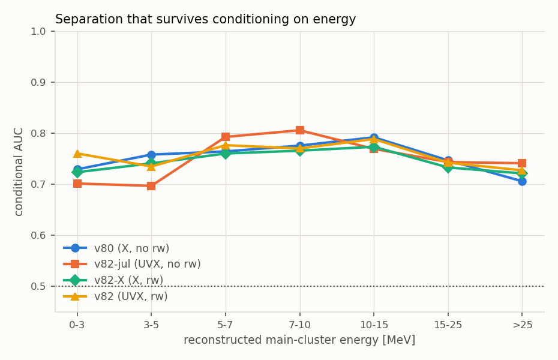

# CT v82: three-plane volumes and energy reweighting

*Follow-up to `docs/CT_v80_energy_topology_study.md`, September 2026. Two new
models were trained on the v80 splits and caps (train cats 400-571, val 572-596,
test 597-621; 20 000 volumes per class for train, 3 000 val, 4 000 test). Nothing
under `.../neural-networks/channel_tagging/` was modified or deleted, and cats
1-399 and 623+ were not touched.*

---

## Executive summary

The v80 study made two recommendations that this note tests: **(2)** retrain with
the two classes reweighted to a common energy spectrum, and **(5)** feed the U and
V planes as well as X, expecting "a few points of conditional AUC at best" and
only in combination with (2). Both were implemented in
`train_ct_three_plane_volumes_v82.py` as configuration options, and a controlled
2x2 was run.

1. **The reweighting works, and it is the whole effect.** The energy slide is
   essentially gone: the median `P(ES)` for ES falls by 0.071 from the 0-3 MeV bin
   to the 15-25 MeV bin, against 0.505 for v80; for CC the slide falls from 0.624
   to 0.025 (Table C). The ES efficiency at a fixed global threshold is now flat
   in energy instead of falling by two orders of magnitude (Fig. 2).
2. **At the deployed CC rejection (0.945) the fraction of ES pointing information
   retained goes from 0.115 (v80) to 0.199 (v82), and the E > 10 MeV ES
   efficiency from 0.032 to 0.206 - a factor 6.4** (Table E). This beats the
   free threshold-policy fix of the v80 study (0.161) by a further 24%, so
   retraining is worth doing on top of, not instead of, recommendation 1.
3. **The marginal AUC drops from 0.842 to 0.788, and that is the intended
   behaviour** - it is the part of the AUC that came from `P(class | E)`. The
   metric that a global threshold can actually exploit, the AUC after both classes
   are matched in energy, goes the other way: **0.691 -> 0.756** (Table A).
4. **The three planes are a real but marginal gain, and they do not help the
   metric that matters.** Against an X-plane-only model trained identically on
   exactly the same events with the same reweighting, adding U and V is worth
   **+0.011 [+0.005, +0.016] in marginal AUC** and about **+0.01 in conditional
   AUC** (positive in 6 of 7 energy bins, individually significant in one;
   Table B2). On the metric that matters the gain does not survive at all: the
   ES pointing information retained is 0.199 (three planes) against 0.208 (one
   plane) at CC rejection 0.945, a paired-bootstrap difference of
   -0.010 [-0.040, +0.018], i.e. consistent with zero and pointing the wrong way.
   Without reweighting, three planes are worth nothing at all (Table A, rows 1-2).
5. **A blocking problem was found in the pipeline while checking integration**,
   and it affects the *currently deployed single-plane* CT: `channel_tagger.py`
   indexes the volume file by the cluster's `match_id` as if it were a positional
   index, and the two disagree for **32.2%** of volumes in the test cats
   (Section 6).

The recommendation is: **take the reweighting, leave the second and third planes
for later.** One plane plus reweighting (`v82-X`) matches the three-plane model on
the pointing metric within uncertainty, is a drop-in for the existing pipeline
(same single-tensor input, same `log1p` preprocessing), and does not inherit the
low-energy selection loss of Section 2. The three-plane model is the better
*classifier* by one point of AUC; that point does not buy pointing power.

| model | path |
|---|---|
| `v82` (U+V+X, reweighted) | `/eos/project-e/ep-nu/evilla/sn-online-pointing/neural-networks/channel_tagging/ct_three_plane_volumes_v82_20260906_212237/` |
| `v82-X` (X only, reweighted) | `/eos/project-e/ep-nu/evilla/sn-online-pointing/neural-networks/channel_tagging/ct_three_plane_volumes_v82_xonly_20260906_210737/` |

---

## 1. What was run

| tag | planes | energy reweighting | caps (per class) | epochs | provenance |
|---|---|---|---|---|---|
| `v80` | X | no | 20k / 3k / 4k | 18 | existing, `ct_volume_v80_20260706_224935` |
| `v82-jul` | U+V+X | no | 10k / 2k / 3k | 19 | existing, `ct_three_plane_vol_v82_20260707_091126` |
| `v82-X` | X | **yes** | 20k / 3k / 4k | 13 | this work |
| `v82` | U+V+X | **yes** | 20k / 3k / 4k | 17 | this work |

The 2x2 is deliberate. `v80 -> v82-jul` isolates the planes without reweighting,
`v82-X -> v82` isolates the planes with it, and `v80 -> v82-X` isolates the
reweighting. Comparing only v80 with v82 would confound two changes.

`v82-X` and `v82` were trained by the same script from the same seed on the
**identical** event selection (both require a U, V and X volume to exist), so
their test sets are the same 8 000 volumes in the same order - verified event by
event - and the difference between them can be bootstrapped as a paired
comparison. Both use per-plane conv towers `[24, 24, 32, 32, 48, 48]`, GAP,
dense `[96, 32]`, dropout 0.3, `log1p` images, no per-image normalisation,
batch 32, Adam 1e-3, early stopping on the (weighted) validation accuracy.

Note the premise that v82 "had never been run to completion" turned out to be
wrong: a July 2026 run did finish, at half the caps, and its scores are used
above as the no-reweighting three-plane point. It took 53 hours, almost all of it
in the data loader; see Section 5.

---

## 2. Do the three planes describe the same interaction? (yes - if you match on the event)

v82 matches volumes across planes on **(file basename, event number)**. Checks on
a random sample of files from each split:

### Table G - cross-plane matching

| split | X volumes | with a U and V counterpart | same `source_root_file` | same `interaction_type` | identical truth momenta | same `main_cluster_match_id` |
|---|---|---|---|---|---|---|
| train (400-571) | 685 | 674 (0.984) | 1.000 | 1.000 | 1.000 | 0.721 |
| val (572-596) | 678 | 654 (0.965) | 1.000 | 1.000 | 1.000 | 0.740 |
| test (597-621) | 677 | 662 (0.978) | 1.000 | 1.000 | 1.000 | 0.701 |

Every matched triplet has the same source ROOT file, the same interaction type
and bit-identical `main_track_momentum*` truth values in all three planes, so the
match is exact. The three volume centres agree in drift time to a median of
11 ticks, 99.4% of them inside half the 1242-tick window, so the images also cover
the same region. No volume file in any sample contained two volumes for the same
event; the loader drops any that does and counts them.

**`main_cluster_match_id` is not a valid cross-plane key** - it agrees across the
three planes for only 70-74% of matched volumes, because it names the cluster
that seeded the volume and the plane-local main cluster is often a different
physical cluster.

**The three-plane requirement is not energy-neutral.** This is the most important
caveat in this note:

### Table H - fraction of X-plane volumes that have a U and V counterpart, vs energy (10 test cats)

| E [MeV] | ES: N(X vols) | ES: 3-plane match eff | CC: N(X vols) | CC: 3-plane match eff |
|---|---|---|---|---|
| 0-3 | 156 | **0.513** | 26 | **0.615** |
| 3-5 | 174 | 0.948 | 14 | 1.000 |
| 5-7 | 167 | 0.970 | 48 | 0.979 |
| 7-10 | 243 | 1.000 | 113 | 1.000 |
| 10-15 | 300 | 0.993 | 292 | 1.000 |
| 15-25 | 225 | 1.000 | 489 | 1.000 |
| >25 | 34 | 1.000 | 252 | 1.000 |
| **all** | 1299 | 0.929 | 1234 | 0.991 |

Below 3 MeV only about half the ES volumes exist in U and V at all: the induction
planes carry a factor 2.5 fewer hit pixels than collection (mean 73 on U and 82 on
V against 201 on X), so the smallest deposits do not form a cluster there and no
volume is created. A three-plane tagger therefore cannot be applied to ~49% of
0-3 MeV ES events, and its test set has 7% of ES below 3 MeV where v80's has 13%.

For the headline metric this is nearly harmless - the 0-3 MeV bin carries **1.1%**
of the total ES pointing information, so losing half of it costs 0.6% - but it
does make the marginal accuracy and AUC comparison between one- and three-plane
models slightly apples-to-oranges. Every table below is therefore also available
restricted to E >= 3 MeV, where the two populations agree to better than 1%; those
numbers are quoted in the text where they change the reading.

---

## 3. The reweighting

Per-sample weights are computed **within each split** from the reconstructed
main-cluster energy of the X-plane volume (`particle_energy` - an observable
available online, not truth):

```
h_c(E)    = histogram of class c, normalised to unit sum
target(E) = 0.5 * (h_ES(E) + h_CC(E))
w_i       = target(E_i) / h_{class(i)}(E_i),   clipped at 10
```

then renormalised so the two classes carry equal total weight. Bins are 1 MeV
wide up to 10 MeV, 2 MeV up to 20, then 20-25-30-40-60-inf. On the training sample
the weights run from 0.53 to 8.0 and the clip never binds. The cost is
statistical: on the test split the effective sample size `(sum w)^2 / sum w^2`
is 0.78 of N for ES and 0.73 for CC (0.76 and 0.64 on a metadata-only sample of
the training cats), i.e. the reweighted 20k+20k training set is worth roughly
15k+14k unweighted events.

The weights go to `model.fit` as sample weights and, through
`weighted_metrics=['accuracy']`, also drive the validation accuracy that early
stopping and the checkpoint monitor. (In Keras 3 only `weighted_metrics` receive
the sample weight; metrics listed under `metrics` do not - this is easy to get
wrong and would silently leave early stopping on the unweighted objective.)

---

## 4. Results





### Table A - marginal test metrics (balanced 1:1 test set, 4000+4000)

| model | accuracy @0.5 | AUC | AUC after energy matching |
|---|---|---|---|
| v80 (X, no rw) | 0.7591 | 0.8418 | 0.6907 |
| v82-jul (UVX, no rw) | 0.7683 | 0.8431 | 0.6872 |
| v82-X (X, rw) | 0.7076 | 0.7771 | **0.7457** |
| v82 (UVX, rw) | 0.7249 | 0.7876 | **0.7563** |

"AUC after energy matching" reweights both classes to the mean reconstructed-energy
spectrum before computing the AUC: it is the separation that does *not* come from
the two classes having different energy spectra, and it is the number a single
global threshold can exploit. For v80 it is 0.691 while the *mean conditional* AUC
is 0.758 - that 0.067 gap is exactly the cost of the uncalibrated score. The
reweighted models close most of it.

### Table B - conditional AUC in bins of reconstructed main-cluster energy

| E [MeV] | N(ES) | N(CC) | v80 (X, no rw) | v82-jul (UVX, no rw) | v82-X (X, rw) | v82 (UVX, rw) |
|---|---|---|---|---|---|---|
| 0-3 | 520 | 119 | 0.729 | 0.701 | 0.724 | 0.760 |
| 3-5 | 506 | 83 | 0.758 | 0.697 | 0.741 | 0.735 |
| 5-7 | 514 | 152 | 0.764 | 0.793 | 0.760 | 0.776 |
| 7-10 | 704 | 386 | 0.776 | 0.806 | 0.766 | 0.770 |
| 10-15 | 915 | 955 | 0.792 | 0.769 | 0.773 | 0.789 |
| 15-25 | 695 | 1559 | 0.747 | 0.743 | 0.733 | 0.742 |
| >25 | 146 | 746 | 0.706 | 0.741 | 0.721 | 0.727 |
| **all (marginal)** | 4000 | 4000 | **0.842** | **0.843** | **0.777** | **0.788** |

(Counts are v80's; the reweighted models share their own identical draw, listed in
Table C.) **The conditional AUC is unchanged by the reweighting** - 0.72-0.79
everywhere, as before. That is the expected result: reweighting removes the
class-vs-energy prior, which the conditional AUC never saw in the first place.
What it changes is that the score is now comparable across energies.

### Table B2 - the actual three-plane test: v82 minus v82-X, paired on the same 8000 events

2000-replicate bootstrap over events; both models saw the identical test set in
the identical order.

| E [MeV] | N(ES) | N(CC) | AUC UVX | AUC X | difference [95% CI] |
|---|---|---|---|---|---|
| 0-3 | 302 | 60 | 0.760 | 0.724 | +0.037 [-0.013, +0.085] |
| 3-5 | 537 | 85 | 0.735 | 0.741 | -0.006 [-0.038, +0.025] |
| 5-7 | 541 | 155 | 0.776 | 0.760 | +0.016 [-0.005, +0.039] |
| 7-10 | 745 | 387 | 0.770 | 0.766 | +0.004 [-0.011, +0.020] |
| 10-15 | 970 | 971 | 0.789 | 0.773 | **+0.015 [+0.005, +0.026]** |
| 15-25 | 750 | 1587 | 0.742 | 0.733 | +0.009 [-0.000, +0.020] |
| >25 | 155 | 755 | 0.727 | 0.721 | +0.006 [-0.019, +0.030] |
| **marginal** | 4000 | 4000 | **0.788** | **0.777** | **+0.011 [+0.005, +0.016]** |

**This is the answer to "do three planes improve the conditional AUC".** Yes, by
about one point: the difference is positive in six of the seven bins and in the
marginal, but only the 10-15 MeV bin and the marginal are individually
significant. The v80 study's expectation - "a few points of conditional AUC at
best" - was, if anything, slightly optimistic.

### Table C - median P(ES) per class per energy bin (the calibration slide)

| E [MeV] | v80 ES | v80 CC | v82-jul ES | v82-jul CC | v82-X ES | v82-X CC | v82 ES | v82 CC |
|---|---|---|---|---|---|---|---|---|
| 0-3 | 0.894 | 0.844 | 0.930 | 0.876 | 0.616 | 0.392 | 0.675 | 0.415 |
| 3-5 | 0.890 | 0.780 | 0.931 | 0.854 | 0.610 | 0.399 | 0.698 | 0.445 |
| 5-7 | 0.853 | 0.588 | 0.892 | 0.649 | 0.609 | 0.387 | 0.688 | 0.408 |
| 7-10 | 0.776 | 0.444 | 0.820 | 0.470 | 0.593 | 0.371 | 0.656 | 0.402 |
| 10-15 | 0.570 | 0.275 | 0.652 | 0.358 | 0.575 | 0.331 | 0.638 | 0.379 |
| 15-25 | 0.389 | 0.219 | 0.443 | 0.249 | 0.534 | 0.334 | 0.604 | 0.390 |
| >25 | 0.239 | 0.166 | 0.280 | 0.156 | 0.482 | 0.312 | 0.572 | 0.390 |
| **slide, ES (0-3 minus 15-25)** | **+0.505** | | **+0.487** | | **+0.082** | | **+0.071** | |
| **slide, CC (0-3 minus 15-25)** | | **+0.624** | | **+0.626** | | **+0.058** | | **+0.025** |

**The energy slide is gone.** A score of 0.6 means roughly the same thing at
2 MeV and at 20 MeV for the reweighted models; for v80 it means "a typical ES
event" at 3 MeV and "a very unusual event" at 15 MeV. Some residual is left
(0.07-0.08 for ES), and it is what makes the E > 25 MeV efficiency of v82 sag in
Table D.

### Table D - ES efficiency per energy bin at a global threshold giving a matched CC rejection

**CC rejection = 0.945 (the deployed working point of v80)**

| model | threshold | 0-3 | 3-5 | 5-7 | 7-10 | 10-15 | 15-25 | >25 | ES eff (E>10) | ES eff (all) | ES pointing info kept |
|---|---|---|---|---|---|---|---|---|---|---|---|
| v80 (X, no rw) | 0.800 | 0.908 | 0.864 | 0.695 | 0.432 | 0.060 | 0.003 | 0.000 | 0.032 | 0.407 | 0.115 |
| v82-jul (UVX, no rw) | 0.805 | 0.921 | 0.888 | 0.762 | 0.549 | 0.168 | 0.009 | 0.009 | 0.090 | 0.436 | 0.152 |
| v82-X (X, rw) | 0.683 | 0.123 | 0.117 | 0.220 | 0.271 | 0.237 | 0.197 | 0.181 | **0.217** | 0.207 | **0.208** |
| v82 (UVX, rw) | 0.729 | 0.281 | 0.358 | 0.323 | 0.258 | 0.237 | 0.188 | 0.103 | **0.206** | 0.258 | **0.199** |

**CC rejection = 0.900**

| model | threshold | 0-3 | 3-5 | 5-7 | 7-10 | 10-15 | 15-25 | >25 | ES eff (E>10) | ES eff (all) | ES pointing info kept |
|---|---|---|---|---|---|---|---|---|---|---|---|
| v80 (X, no rw) | 0.668 | 0.967 | 0.905 | 0.837 | 0.679 | 0.376 | 0.058 | 0.000 | 0.219 | 0.563 | 0.238 |
| v82-jul (UVX, no rw) | 0.709 | 0.963 | 0.945 | 0.841 | 0.712 | 0.403 | 0.100 | 0.009 | 0.248 | 0.562 | 0.263 |
| v82-X (X, rw) | 0.633 | 0.437 | 0.421 | 0.421 | 0.427 | 0.372 | 0.312 | 0.252 | **0.338** | 0.385 | **0.332** |
| v82 (UVX, rw) | 0.688 | 0.457 | 0.542 | 0.497 | 0.409 | 0.368 | 0.312 | 0.161 | **0.329** | 0.405 | **0.317** |

The shape of the row is the point. v80 runs 0.91 -> 0.00 across the seven bins;
`v82-X` runs 0.12 -> 0.18, i.e. flat, and it is flat *because* nothing in the loss
rewarded the model for reading the energy.

### Table E - working-point summary, the v80 study's Table 8 columns

| model | selection | ES eff (all) | CC rej (all) | ES eff (E>10) | CC rej (E>10) | **ES pointing information kept** |
|---|---|---|---|---|---|---|
| v80 | global P(ES) > 0.80 (deployed) | 0.407 | 0.945 | 0.032 | 0.995 | **0.115** |
| v80 | CC rej 0.900 | 0.563 | 0.900 | 0.219 | 0.968 | 0.238 |
| *(v80 study, per-ADC-decile thresholds at CC rej 0.942)* | | 0.151 | 0.942 | 0.153 | 0.944 | *0.161* |
| v82-jul | CC rej 0.945 | 0.436 | 0.945 | 0.090 | 0.986 | 0.152 |
| v82-jul | CC rej 0.900 | 0.562 | 0.900 | 0.248 | 0.954 | 0.263 |
| **v82-X** | **CC rej 0.945** | 0.207 | 0.945 | **0.217** | 0.949 | **0.208** |
| **v82-X** | **CC rej 0.900** | 0.385 | 0.900 | **0.339** | 0.907 | **0.332** |
| **v82** | **CC rej 0.945** | 0.258 | 0.945 | **0.206** | 0.952 | **0.199** |
| **v82** | **CC rej 0.900** | 0.405 | 0.900 | **0.329** | 0.910 | **0.317** |

"ES pointing information kept" is the fraction of `sum(1/theta68(E)^2)` over ES
events that survives the selection, with `theta68` per energy bin fixed to Table 0
of the v80 study (36.5, 24.5, 19.2, 14.9, 10.9, 7.1, 4.6 deg) so that every model
is scored on the same yardstick.

At the deployed CC rejection, retraining with the reweighting is worth
**0.208 against 0.115, a factor 1.8**, and 21.7% of the E > 10 MeV ES against
3.2%, a factor 6.8. Both reweighted models comfortably beat the free
threshold-policy fix of the v80 study (0.161).

The two reweighted models are **indistinguishable on this metric**. Paired
bootstrap of (three planes - one plane) over the shared 8000 test events:

| working point | UVX | X | difference [95% CI] |
|---|---|---|---|
| CC rejection 0.945 | 0.199 | 0.208 | -0.010 [-0.040, +0.018] |
| CC rejection 0.900 | 0.317 | 0.332 | -0.015 [-0.035, +0.016] |

So the +0.011 of marginal AUC that the third and second planes buy (Table B2)
does not convert into pointing power. The likely reason is visible in Table D:
`v82` retains a mild preference for low energy (0.28 in the 0-3 MeV bin against
0.10 above 25 MeV) where `v82-X` is flat or slightly rising, and the pointing
weight is concentrated at high energy.

Restricting every model to E >= 3 MeV, where the one-plane and three-plane
populations coincide, the same comparison at CC rejection 0.945 reads
v80 0.158, v82-jul 0.169, v82 0.198, v82-X 0.209 - the ordering and the
conclusion are unchanged, but v80's baseline improves because the low-energy ES
it preferentially selects have been removed from the denominator.

### Table F - cross-check of the pointing yardstick on the v82 test draw

| E [MeV] | theta68, v80 study Table 0 [deg] | theta68 measured on the v82 test set [deg] |
|---|---|---|
| 0-3 | 36.5 | 31.7 (302 ES) |
| 3-5 | 24.5 | 24.5 (537) |
| 5-7 | 19.2 | 19.2 (541) |
| 7-10 | 14.9 | 14.9 (745) |
| 10-15 | 10.9 | 10.9 (970) |
| 15-25 | 7.1 | 7.1 (750) |
| >25 | 4.6 | 4.6 (155) |

Identical everywhere except the 0-3 MeV bin, where the three-plane requirement
keeps the brighter half of the events, which also have smaller opening angles.
Using the study's fixed values for all models is the conservative choice and the
discrepancy affects 1.1% of the weight.

---

## 5. What changed in the trainer

`train_ct_three_plane_volumes_v82.py` was rewritten additively: planes and
reweighting are configuration keys, and the same script produces the three-plane
model and the one-plane ablation (`data.match_planes` fixes the event selection,
`data.input_planes` chooses which images are fed). Three defects had to be fixed
before it could be run at the v80 caps:

- **Per-event decompression.** The old loop did
  `plane_data[p]['images'][idx]` inside the per-event loop; `NpzFile.__getitem__`
  decompresses the whole `images` member on every call, so each file was
  decompressed ~38 times per plane. This is why the July run took 53 hours with
  half the caps. The arrays are now read once per file. The new runs took
  3.0 h (three planes) and 1.2 h (one plane) at double the caps, both
  exiting 0.
- **Memory.** The v80 pattern (`from_tensor_slices` over a dense float16 array)
  would need ~200 GB for three planes at the v80 caps, and the earlier v82 job
  peaked at 131 GB against a 120 GB request. The images are in fact extremely
  sparse - a mean of 201 nonzero pixels out of 258 336 on X, 73 on U, 82 on V -
  so they are now stored as (flat index, log1p value, offsets) and densified one
  batch at a time inside the `tf.data` generator. That is 0.09 GB instead of
  62 GB for the training split; the reconstruction was checked to be bitwise
  identical to the dense path. The jobs now request 16 GB and 12 GB and schedule
  easily.
- **Epoch bookkeeping.** The generator dataset had no `repeat` and no
  `steps_per_epoch`, so Keras hit end-of-sequence every epoch. It now loops with
  a fresh shuffle per pass and `steps_per_epoch = ceil(N / batch)`; each epoch was
  verified to see every sample exactly once.

`test_predictions.npz` now carries, per test event, the score, the label, the
reconstructed energy, the total ADC per plane, the number of nonzero pixels, the
cat id, the event number, the source file basename, the truth opening angle and
the reweighting weight - so no score-to-metadata replay (Section 1 of the v80
study) is needed to analyse it.

---

## 6. What it would take to run a three-plane CT in the pointing pipeline

*Report only - nothing in `refactor-snop-pipeline` was modified.*

### Where the pipeline is pinned to X

| what | where | note |
|---|---|---|
| volume-image plane | `python/lib/sample_loader.py:228` `vol_folder_path = Path(vol_folder) / 'X'` | the only place a volume-image path is built; `/X` is hard-coded and no pipeline config has a plane key |
| volume file name | `sample_loader.py:268-272` | derived from the cluster file name by stripping `_matched`; U and V follow by `.replace('planeX', 'planeU'/'planeV')` |
| what reaches the tagger | `sample_loader.py:295` `vol_images_list.append((vol_file_ref, match_id))` | one X path and one match_id per sample |
| model input | `channel_tagger.py:99` and `:223`, `model.predict(<single array>)` | a three-plane keras model needs three inputs |
| U/V discarded | `channel_tagger.py:92-95` `if isinstance(images, dict) and 'X' in images: images = images['X']` | that "3-plane mode" is about cluster images, for the ED stage |
| config keys | `input_data.{cc,es}_vol_folder`, `neural_networks.channel_tagger.{model_path,threshold}` | the `*_vol_folder` value is already the plane-agnostic base directory, so no config change is needed to *find* U and V |

U and V **volume** images are read nowhere in the pipeline.

### The changes, in order

1. **Fix the volume lookup first - it is wrong today, for the deployed
   single-plane model.** `channel_tagger.py:215-218` does
   `batch_imgs.append(vol_images[match_id])`, using the cluster's `match_id` as a
   *positional index* into the volume file's `images` array. Scanning 1343
   volumes in 35 X-plane volume files of the test cats, the volume at position
   *k* has `main_cluster_match_id != k` for **32.2%** of volumes (in 83% of
   files), and 79 volumes carry `main_cluster_match_id = -1`. So roughly a third
   of the volumes scored by the deployed CT are the wrong volume for the cluster
   they are attached to. This should be confirmed on a full pipeline run and
   fixed before any three-plane work.
2. **Match on `(file basename, event)`, per plane.** Load `vol_data['metadata']`
   (the tagger currently reads only `vol_data['images']`), build `{m['event']: i}`
   per plane and intersect. Section 2 shows this is unambiguous. Do **not** match
   on `main_cluster_match_id`.
3. **The key is already in the pipeline's hands.** `sample_loader.py:280`
   computes `event_num = int(meta_x[idx_x, 0])` and `:292` appends `meta_x[idx_x]`
   to `metadata_list`, so the metadata array passed to `tag_channels` carries the
   event number in column 0, index-aligned with the samples, and `vol_refs[i][0]`
   is the X volume path. Nothing new has to be plumbed through - the key just has
   to be used.
4. **Feed three tensors.** Replace the single array at `channel_tagger.py:99` and
   `:223`, and apply `_preprocess_ct_images` per plane. Preprocessing *resolution*
   already works: v82 writes `preprocessing.image = "log1p"` into its
   `results.json`, which is what `_resolve_preprocess_mode` looks for. The v82
   model has named inputs `image_U`, `image_V`, `image_X`, so a dict feed is
   safest.
5. **Decide what to do with events that have no U or V volume** - 2-7% overall
   and ~49% of ES below 3 MeV. `predictions/channel_predictions.npz` is joined to
   the volume list **by row index only** (`python/ana/burst_direction.py:285-296,
   307-317, 747-753`), so a three-plane tagger must emit a placeholder score plus
   a "no CT decision" flag, or the join must be made explicit with a key column.
   Silently dropping rows would misalign every downstream selection.
6. **Turn the volume path on in batch mode.** `python/app/pipeline_batch.py:164`
   sets `load_all_planes = False` and never sets `*_vol_folder`, and the volume
   references are only built inside the `load_all_planes` branch
   (`sample_loader.py:239`), so the batch driver currently runs CT on cluster
   images, not volume images, whatever model is configured.

**Is the per-event matching of the three planes at inference unambiguous?**
Yes on `(volume file basename, event number)` - unique within a file, present in
all three planes' metadata, and 100% pure in every sample checked. No on
`main_cluster_match_id`, which is the key the pipeline currently carries.

**None of this is needed for `v82-X`**, which is a single-tensor model with the
same input signature and the same `log1p` preprocessing as v80: swapping
`model_path` and re-tuning `threshold` (0.80 is far too high for it - see
Table E, where it selects nothing) is the whole change. Item 1 remains a bug
worth fixing regardless.

---

## 7. Caveats

- **The one-plane and three-plane models are not evaluated on the same events**
  (Section 2). All comparisons are given over the full test draw and over
  E >= 3 MeV; `v82` and `v82-X` *are* on identical events, which is why the
  three-plane conclusion rests on Table B2 and not on the v80 comparison.
- **`particle_energy` is reconstructed, not truth.** The reweighting therefore
  removes the *class-vs-energy prior*, not the *score-vs-brightness* dependence
  that the v80 study identified as the mechanism (`log(total ADC)` alone reaches
  AUC 0.803 and explains 72% of the v80 logit). Recommendation 3 of that study -
  per-image normalisation with the calorimetric scale handed over as explicit
  scalars - is the complementary change and was **not** done here. The residual
  slide of 0.07 in Table C is consistent with brightness still leaking in.
- **Reweighting costs statistics**: effective sample size 0.78 (ES) and 0.73 (CC)
  of the nominal count. Part of any v82-vs-v80 conditional-AUC difference is this.
- **The X-only ablation has fewer filters per tower than v80** (24/24/32/32/48/48
  against 32/32/48/48/64/64), because it is built as the exact single-tower
  counterpart of v82 rather than a copy of v80. v80 is the "as deployed"
  reference; `v82-X` is the controlled one.
- **The validation metric is noisy** (+-0.02 between epochs). `v82-X` restored
  weights from epoch 2 and `v82` from epoch 6, both on a plateau, so the
  best-epoch choice is somewhat arbitrary; the +0.011 marginal AUC gap between
  them is larger than the bootstrap error but not obviously larger than the
  epoch-to-epoch scatter. A seed ensemble would settle it and was not run.
- **Thresholds are chosen on the test set** to hit a target CC rejection exactly,
  identically for every model, so the quoted efficiencies are optimistic in the
  same way for all of them.
- **One radiological rate.** As in the v80 study, the test cats all sit at ~2.4
  non-MARLEY clusters per volume while parts of the validation range are at ~0.66.
- **No pointing resolution is quoted.** Turning any of this into a supernova
  pointing number needs the snop-pipeline scenarios on cats 1-399 or 623+, which
  is out of scope and would need the Section 6 changes first.
- The augmentation flips the channel axis of all three planes together. That is
  the direct analogue of the v80 augmentation but is not an exact detector
  symmetry for the induction planes; it was kept for comparability and is a
  plausible thing to ablate next.

---

## 8. Reproducing

```bash
source scripts/init.sh          # LCG_106_cuda view

# training (HTCondor, 1 GPU each; 3.0 h and 1.2 h wall clock)
condor_submit channel_tagging/condor/submit_three_plane_v82.sub        # U+V+X + reweighting
condor_submit channel_tagging/condor/submit_three_plane_v82_xonly.sub  # X only + reweighting

# two-minute local check of the whole path (2 cats, 30 volumes/class, 2 epochs)
python3 channel_tagging/models/train_ct_three_plane_volumes_v82.py \
        -j channel_tagging/json/three_plane_volumes_v82.json \
        --test-local --out-dir /tmp/v82_smoke

# every table and figure above
NN=/eos/project-e/ep-nu/evilla/sn-online-pointing/neural-networks/channel_tagging
DEV=/eos/user/e/evilla/dune/sn-tps/neural_networks/channel_tagging
python3 channel_tagging/ana/ct_v82_compare.py \
        --model "v80 (X, no rw)=$NN/ct_volume_v80_20260706_224935" \
        --model "v82-jul (UVX, no rw)=$DEV/ct_three_plane_vol_v82_20260707_091126" \
        --model "v82-X (X, rw)=$NN/ct_three_plane_volumes_v82_xonly_20260906_210737" \
        --model "v82 (UVX, rw)=$NN/ct_three_plane_volumes_v82_20260906_212237" \
        --figdir docs/figures/ct_v82_study --tables /tmp/v82_tables.md
# add --emin 3.0 for the population-matched version
```

`ct_v82_compare.py` reproduces the v80 study's Tables 2, 3 and 8 exactly when run
on the v80 model alone (conditional AUCs 0.729 / 0.758 / 0.764 / 0.776 / 0.792 /
0.747 / 0.706, marginal 0.842, ES pointing information 0.115 at P(ES) > 0.80),
which is the check that the evaluation code here and the study's agree.

| file | what it is |
|---|---|
| `channel_tagging/models/train_ct_three_plane_volumes_v82.py` | the trainer; planes and reweighting are config options |
| `channel_tagging/json/three_plane_volumes_v82.json` | U+V+X, reweighting on, v80 splits and caps |
| `channel_tagging/json/three_plane_volumes_v82_xonly.json` | the X-only ablation on the identical event selection |
| `channel_tagging/condor/submit_three_plane_v82{,_xonly}.sub` | 1 GPU, nextweek flavour |
| `channel_tagging/ana/ct_v82_compare.py` | all tables and figures in this note |
| `docs/figures/ct_v82_study/` | the three figures |
