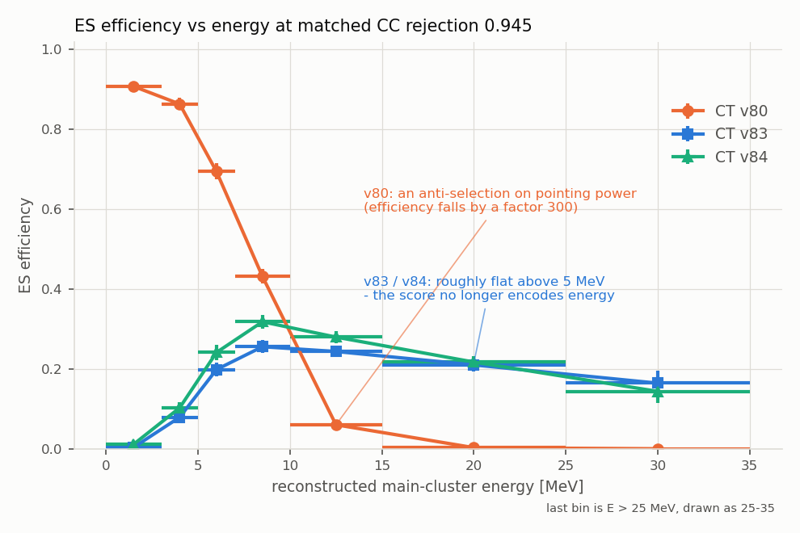

# CT v83, v84 and v85: removing the energy shortcut from the channel tagger

*Three retrainings following recommendations 2, 3 and 4 of
[CT_v80_energy_topology_study.md](CT_v80_energy_topology_study.md), September 2026.
Trained and evaluated strictly on the v80 splits - train cats 400-571, validation
572-596, test 597-621. Cats 1-399 and 623-1224 (the evaluation set) were not
touched, and nothing under the existing model or sample directories was modified.*

---

## Executive summary

The v80 study concluded that the deployed channel tagger is not a bad classifier
but a **miscalibrated** one: at fixed energy it separates ES from CC with AUC
0.71-0.79, yet the score of *both* classes slides down with energy (median `P(ES)`
0.89 -> 0.24 for ES, 0.84 -> 0.17 for CC), so a single global threshold degenerates
into an energy cut and throws away exactly the high-energy ES events that carry the
pointing information. It recommended (2) retraining with the two classes reweighted
to a common energy spectrum, (3) taking the absolute brightness out of the pixels
and handing it to the network explicitly, and (4) masking the radiological clusters
the tagger reacts to but which carry no class information.

Recommendations 2 and 3 were done first, as v83 and v84. **They work, and the effect
is large.**

| | CT v80 (deployed) | CT v83 | CT v84 |
|---|---|---|---|
| marginal AUC | 0.842 | 0.770 | 0.765 |
| conditional AUC range (7 energy bins) | 0.706-0.792 | 0.726-0.785 | 0.731-0.786 |
| median `P(ES)` slide, ES, 0-3 -> >25 MeV | **-0.655** | -0.072 | **+0.024** |
| median `P(ES)` slide, CC, 0-3 -> >25 MeV | **-0.677** | +0.011 | -0.027 |
| ES eff, E > 10 MeV, at CC rejection 0.945 | 0.032 | 0.224 | **0.244** |
| ES pointing information kept @ CC rej 0.945 | 0.116 | 0.207 | **0.222** |
| ES pointing information kept @ CC rej 0.90 | 0.240 | 0.347 | **0.353** |

A third retraining, **v85**, repeats the v83 recipe on the radiological-masked
volume product (recommendation 4). Its result is summarised in point 5 and in
Section 5; in one line, *applying* the mask helps a little and *training* on it does
not.

Five things are worth stating plainly.

1. **The energy slide is gone.** Over the full 0-3 -> >25 MeV range the median CC
   score moves by -0.677 in v80 and by -0.027 (v84) / +0.011 (v83); the median ES
   score moves by -0.655 in v80 and by +0.024 (v84) / -0.072 (v83). This was the
   stated objective and it is achieved essentially completely (Table G).
   **The slide against total ADC is only reduced, not removed**: across ADC deciles
   the CC median still moves by -0.22 to -0.24, against -0.76 for v80 (Table H). The
   weights were built in energy, so flatness in energy is partly circular; flatness
   in brightness is the independent test, and it is ~70% achieved, not 100%.
   Per-image normalization did **not** help here - see point 4.
2. **No discrimination was lost.** The conditional AUC in every energy bin is the
   same as v80 to within +-0.02, and both new models are *better* than v80 above
   25 MeV (0.730 / 0.737 vs 0.706). The marginal-AUC drop from 0.842 to ~0.77 is
   entirely the removal of the free `P(CC|E)` information from a 1:1 mixture with
   different spectra - it is the point of the exercise, not a regression.
3. **At the metric that matters this is a factor 1.8-1.9.** At the deployed CC
   rejection of 0.945 the retained ES pointing information goes from 0.116 to 0.207
   (v83) and 0.222 (v84), and the E > 10 MeV ES efficiency from 0.032 to 0.224 and
   0.244 - a factor 7-7.6. Retraining also **beats the free post-hoc fix**: the
   ADC-flattened threshold policy of Table 8 reached 0.161 at the same rejection,
   against 0.222 for v84.
4. **v84 is modestly but significantly better than v83 at the tight working point**
   (ES efficiency +0.029 +- 0.005 overall and +0.020 +- 0.008 above 10 MeV at CC
   rejection 0.945, paired on the same events; the edge shrinks to ~1 sigma at CC
   rejection 0.90 - Table I). Its structural advantage is larger than its numerical
   one: its convolutional branch never sees the absolute pixel scale, so it is
   insensitive to gain/calibration shifts, and its energy dependence is explicit in
   four named scalars. The result that went *against* expectation is that per-image
   normalization did not further decorrelate the score from total ADC - handing
   `log(total ADC)` to the aux branch simply relocates the shortcut rather than
   removing it. **v83 is a drop-in replacement for v80; v84 needs a small pipeline
   change** (Section 6).
5. **The radiological mask is worth applying at inference, but not worth retraining
   on.** Running the *existing* v83 model on masked images is the best cell of the
   2x2: ES efficiency above 10 MeV 0.224 -> 0.237 (+0.013 +- 0.006) and information
   kept 0.207 -> 0.216 (+0.009 +- 0.005), for free. v85 - v83 retrained on masked
   images, on bit-identical volumes - has the highest marginal AUC of any
   reweighted model (0.783) and the *lowest* retained pointing information of the
   four cells (0.202). AUC and the pointing metric point in opposite directions
   here, which is the sharpest illustration in this note of why the metric had to
   change first. Neither model is sensitive to whether the mask is applied at
   inference. Details in Section 5.



The figure is the whole story in one panel: at identical CC rejection, v80 keeps
91% of ES below 3 MeV and 0.3% at 15-25 MeV, while v83/v84 keep 20-30% almost
independently of energy above 5 MeV.

---

## 1. What was trained

Both models were produced by a new trainer,
`channel_tagging/models/train_ct_volume_v83.py`, which is a copy of
`train_ct_volume_v80.py` with three config-gated additions. Architecture, data
caps, cat splits, seed, augmentation, optimizer, batch size, learning rate,
callbacks and early-stopping policy are unchanged.

The trainer consumes the `np.random.RandomState(42)` stream in exactly the same
order and amount as v80, so **all three models were trained, validated and tested
on the same volumes in the same order**. This is not an assumption: the comparison
script asserts that the v83 and v84 `true_labels` and `energies` match the v80 test
set bit-for-bit and refuses to run otherwise. It passed for both.

### 1.1 v83 = v80 + common-energy-spectrum sample weights

The reconstructed main-cluster energy `particle_energy` is histogrammed separately
for ES and CC in the training sample (1 MeV bins to 30 MeV, 5 MeV bins to 60 MeV,
one overflow; 36 bins). With `p_c(b)` the class-normalized histogram,

```
target(b) = ( p_ES(b) + p_CC(b) ) / 2
w_c(b)    = target(b) / p_c(b)
```

renormalized so each class has mean weight exactly 1 (hence equal total weight,
the sample being balanced 20000/20000). The weights go through `tf.data` into
`model.fit` as sample weights, and **the same is done for the validation set**
(each split reweighted to the average of its own two class spectra), so the
quantity early stopping and checkpointing select on is the reweighted one. Test
metrics are deliberately left unweighted, so they are comparable to v80's.

**Why energy and not total ADC.** `particle_energy` is the variable Table 8 of the
v80 study is written in, the variable the ES kinematic pointing weight
`1/theta68(E)^2` depends on, and the variable a deployed selection would be binned
in. It is an online observable (the main-cluster ADC integral over a calibration
constant), not truth. Flattening in total ADC instead would decorrelate the score
from the CNN's single dominant input but would leave a residual slide against the
quantity we actually care about selecting on.

The resulting weights, aggregated into the study's energy bins:

| E bin [MeV] | N ES (train) | N CC (train) | mean w(ES) | mean w(CC) |
|---|---|---|---|---|
| 0-3 | 2713 | 486 | 0.59 | 3.29 |
| 3-5 | 2619 | 389 | 0.57 | 3.87 |
| 5-7 | 2507 | 664 | 0.63 | 2.39 |
| 7-10 | 3509 | 1890 | 0.77 | 1.43 |
| 10-15 | 4346 | 4883 | 1.06 | 0.95 |
| 15-25 | 3479 | 7952 | 1.64 | 0.72 |
| >25 | 827 | 3736 | 2.76 | 0.61 |

The full range over individual bins is [0.532, 8.250]. The extreme is an artefact
of a nearly empty bin (the >55 MeV overflow holds 2 ES and 31 CC events); only 315
of 20000 ES events (1.6%) carry a weight above 3. No clipping was applied - the
formula is used exactly as specified - and training was stable (Section 2).

### 1.2 v84 = v83 + per-image normalization + the aux scalar branch

- **Per-image normalization: divide by the per-image maximum**, applied to the
  log1p image: `x = log1p(ADC); x = x / max(x)`. Stated explicitly because the
  choice matters: normalizing by the max (rather than the sum) keeps the log
  dynamic range the CNN saw in v80/v83, so the *only* thing that changes is the
  removal of the absolute level, and it leaves input values O(1). The trade-off is
  that dividing a log image by its max is not exactly invariant under a rescaling
  of the ADC gain, only insensitive to the overall level; a sum normalization of
  the raw image would be exactly scale-invariant but would destroy the log
  compression. Recorded in `results.json` as
  `preprocessing.per_image_normalization: "max"`.
- **Aux branch**: the `volume_v80_aux.json` branch (never trained until now),
  `[n_clusters_in_volume, log1p(total ADC), log1p(n nonzero pixels)]`, extended
  with the reconstructed main-cluster energy as `log1p(particle_energy)`. Four
  scalars, standardized with training-set mean/std recorded in `results.json`, into
  a `BatchNorm -> Dense(16, relu)` branch concatenated with the CNN's global
  average pool - exactly the pre-existing v80 aux architecture.
- **The aux features are computed from the RAW image**, before log1p and before
  normalization. That is the whole point: the calorimetric scale is taken out of
  the pixels and handed to the network explicitly, so the convolutional part must
  learn shape.

Both the aux features and the image preprocessing live in one new, numpy-only
module, `channel_tagging/lib/ct_volume_features.py`, which the trainer imports.
Training and inference therefore cannot drift apart (Section 6.4).

---

## 2. Training behaviour - was it stable?

Yes, for both. Neither run diverged, neither overfitted, and neither needed a
restart.

| | v80 | v83 | v84 |
|---|---|---|---|
| epochs run (early stopping, patience 10) | 18 | 31 | 33 |
| final train accuracy | 0.769 | 0.707 (weighted) | 0.718 (weighted) |
| best val accuracy | 0.777 | 0.699 (weighted) | 0.704 (weighted) |
| train - val gap at the end | -0.005 | +0.012 | +0.019 |

The reweighted runs converge to a lower accuracy than v80 and take longer to get
there, both expected: the loss no longer contains the free class-vs-energy
correlation, so the task is genuinely harder, and the weighted objective is noisier
per batch. Learning rate decayed to the 1e-5 floor by epoch ~30 in both, and
validation accuracy plateaued flat rather than turning over - no sign of the
instability that large sample weights can cause. With `weighted_metrics` the
reported accuracy is the weighted one, which is why the v83/v84 accuracies in this
table are not comparable to v80's; the comparable, unweighted test numbers are in
Table A.

---

## 3. Evaluation

All numbers below are on the **same balanced test set as v80** - 4000 ES + 4000 CC
volumes from cats 597-621 - and the pointing-information metric and energy binning
are imported directly from `ct_v80_energy_topology.py`, not reimplemented, so they
are directly comparable to Table 8. As a check on the reimplementation, the
comparison script reproduces the published v80 rows exactly (`P(ES) > 0.8`:
ES eff 0.407, CC rej 0.945, ES eff E>10 0.032, information kept 0.116).

Two operating points are used throughout: the global threshold giving **CC
rejection 0.945** (for v80 this is `P(ES) > 0.800`, i.e. the deployed working
point) and the one giving **CC rejection 0.90**.

### Table A - marginal performance on the balanced test set (4000 ES + 4000 CC, cats 597-621)

| model | epochs | best val acc | test accuracy | marginal AUC |
|---|---|---|---|---|
| CT v80 | 18 | 0.7768 | 0.7591 | 0.8418 |
| CT v83 | 31 | 0.6991 | 0.7061 | 0.7698 |
| CT v84 | 33 | 0.7035 | 0.7089 | 0.7646 |

### Table B - conditional AUC in bins of reconstructed main-cluster energy

(0.5 = no separation. A pure energy classifier would give 0.5 in every row.)

| E [MeV] | N(ES) | N(CC) | CT v80 | CT v83 | CT v84 |
|---|---|---|---|---|---|
| 0-3 | 520 | 119 | 0.729 | 0.726 | 0.731 |
| 3-5 | 506 | 83 | 0.758 | 0.762 | 0.742 |
| 5-7 | 514 | 152 | 0.764 | 0.760 | 0.767 |
| 7-10 | 704 | 386 | 0.776 | 0.775 | 0.772 |
| 10-15 | 915 | 955 | 0.792 | 0.785 | 0.786 |
| 15-25 | 695 | 1559 | 0.747 | 0.746 | 0.743 |
| 25-100 | 146 | 746 | 0.706 | 0.730 | 0.737 |
| **all (marginal)** | 4000 | 4000 | **0.842** | **0.770** | **0.765** |

- CT v80: conditional AUC range 0.706-0.792 (mean 0.753)
- CT v83: conditional AUC range 0.726-0.785 (mean 0.755)
- CT v84: conditional AUC range 0.731-0.786 (mean 0.754)

### Table C - global thresholds at matched CC rejection

| model | thr @ CC rej 0.945 | achieved CC rej | thr @ CC rej 0.90 | achieved CC rej |
|---|---|---|---|---|
| CT v80 | 0.8001 | 0.9450 | 0.6683 | 0.9000 |
| CT v83 | 0.7457 | 0.9450 | 0.6909 | 0.9000 |
| CT v84 | 0.7820 | 0.9450 | 0.7397 | 0.9000 |

### Table D1 - ES efficiency per energy bin at global CC rejection 0.945

| E [MeV] | N(ES) | rel. pointing info/event | CT v80 | CT v83 | CT v84 |
|---|---|---|---|---|---|
| 0-3 | 520 | 1.0x | 0.908 | 0.004 | 0.012 |
| 3-5 | 506 | 2.2x | 0.864 | 0.079 | 0.103 |
| 5-7 | 514 | 3.6x | 0.695 | 0.198 | 0.241 |
| 7-10 | 704 | 6.0x | 0.432 | 0.256 | 0.318 |
| 10-15 | 915 | 11.2x | 0.060 | 0.244 | 0.280 |
| 15-25 | 695 | 26.2x | 0.003 | 0.210 | 0.217 |
| 25-100 | 146 | 62.1x | 0.000 | 0.164 | 0.144 |

### Table D2 - ES efficiency per energy bin at global CC rejection 0.9

| E [MeV] | N(ES) | rel. pointing info/event | CT v80 | CT v83 | CT v84 |
|---|---|---|---|---|---|
| 0-3 | 520 | 1.0x | 0.967 | 0.092 | 0.085 |
| 3-5 | 506 | 2.2x | 0.905 | 0.289 | 0.294 |
| 5-7 | 514 | 3.6x | 0.837 | 0.412 | 0.428 |
| 7-10 | 704 | 6.0x | 0.679 | 0.450 | 0.472 |
| 10-15 | 915 | 11.2x | 0.376 | 0.388 | 0.399 |
| 15-25 | 695 | 26.2x | 0.058 | 0.340 | 0.353 |
| 25-100 | 146 | 62.1x | 0.000 | 0.274 | 0.253 |

### Table E - working points, in the metric of Table 8 of the v80 study

| model | operating point | ES eff (all) | CC rej (all) | ES eff (E>10) | CC rej (E>10) | ES pointing information kept |
|---|---|---|---|---|---|---|
| CT v80 | global CC rej 0.945 (thr 0.800) | 0.407 | 0.945 | 0.032 | 0.995 | 0.116 |
| CT v80 | global CC rej 0.9 (thr 0.668) | 0.563 | 0.900 | 0.219 | 0.968 | 0.240 |
| CT v83 | global CC rej 0.945 (thr 0.746) | 0.179 | 0.945 | 0.224 | 0.946 | 0.207 |
| CT v83 | global CC rej 0.9 (thr 0.691) | 0.339 | 0.900 | 0.359 | 0.905 | 0.347 |
| CT v84 | global CC rej 0.945 (thr 0.782) | 0.208 | 0.945 | 0.244 | 0.948 | 0.222 |
| CT v84 | global CC rej 0.9 (thr 0.740) | 0.348 | 0.900 | 0.368 | 0.905 | 0.353 |

("ES pointing information kept" = fraction of sum(1/theta68(E)^2) over ES volumes that survives the selection, theta68 being the 68th percentile of the true electron-neutrino opening angle in that energy bin - exactly the last column of Table 8.)

### Table F - the same selections at the natural 1:9.7 ES:CC prior

Efficiency and rejection are prior-independent; what the prior changes is the composition of the selected sample. For every selected ES volume the selection admits 9.7 x (1 - CC rej) / ES eff CC volumes.

| model | operating point | ES purity (all) | CC per ES (all) | ES purity (E>10) | CC per ES (E>10) |
|---|---|---|---|---|---|
| CT v80 | global CC rej 0.945 | 0.433 | 1.31 | 0.405 | 1.47 |
| CT v80 | global CC rej 0.9 | 0.367 | 1.72 | 0.412 | 1.43 |
| CT v83 | global CC rej 0.945 | 0.251 | 2.98 | 0.299 | 2.34 |
| CT v83 | global CC rej 0.9 | 0.259 | 2.87 | 0.280 | 2.57 |
| CT v84 | global CC rej 0.945 | 0.281 | 2.56 | 0.325 | 2.08 |
| CT v84 | global CC rej 0.9 | 0.264 | 2.79 | 0.285 | 2.50 |

(The E>10 MeV rows use the ES:CC ratio of the balanced test set restricted to E>10 MeV rescaled by the same global 1:9.7 prior, i.e. they answer "of the selected E>10 MeV volumes, what fraction is ES" only under the assumption that the prior is energy-independent; the true CC spectrum is harder than the ES one, so these are optimistic. The prior-independent numbers are in Table E.)

### Table G - the calibration slide: median score per energy bin

| E [MeV] | CT v80 ES | CT v80 CC | CT v83 ES | CT v83 CC | CT v84 ES | CT v84 CC |
|---|---|---|---|---|---|---|
| 0-3 | 0.894 | 0.844 | 0.554 | 0.330 | 0.608 | 0.398 |
| 3-5 | 0.890 | 0.780 | 0.622 | 0.349 | 0.690 | 0.465 |
| 5-7 | 0.853 | 0.588 | 0.654 | 0.317 | 0.717 | 0.339 |
| 7-10 | 0.776 | 0.444 | 0.666 | 0.311 | 0.725 | 0.330 |
| 10-15 | 0.570 | 0.275 | 0.614 | 0.297 | 0.694 | 0.323 |
| 15-25 | 0.389 | 0.219 | 0.579 | 0.321 | 0.676 | 0.359 |
| 25-100 | 0.239 | 0.166 | 0.482 | 0.340 | 0.632 | 0.371 |

| model | median P(ES) for ES: 0-3 -> >25 | slide | for CC: 0-3 -> >25 | slide |
|---|---|---|---|---|
| CT v80 | 0.894 -> 0.239 | -0.655 | 0.844 -> 0.166 | -0.677 |
| CT v83 | 0.554 -> 0.482 | -0.072 | 0.330 -> 0.340 | +0.011 |
| CT v84 | 0.608 -> 0.632 | +0.024 | 0.398 -> 0.371 | -0.027 |

### Table H - control: conditional AUC and median score in deciles of total volume ADC

The weights were built in `particle_energy`, so Tables B and G partly condition on the variable used to construct them. Total ADC was not used to build the weights.

| total ADC range | N(ES) | N(CC) | CT v80 AUC | CT v83 AUC | CT v84 AUC | CT v80 med ES/CC | CT v83 med ES/CC | CT v84 med ES/CC |
|---|---|---|---|---|---|---|---|---|
| 393-18069 | 702 | 98 | 0.662 | 0.694 | 0.675 | 0.898/0.880 | 0.611/0.501 | 0.659/0.539 |
| 18069-29547 | 684 | 116 | 0.687 | 0.693 | 0.683 | 0.865/0.819 | 0.660/0.400 | 0.720/0.520 |
| 29547-40656 | 601 | 199 | 0.694 | 0.686 | 0.695 | 0.796/0.664 | 0.673/0.420 | 0.736/0.503 |
| 40656-51886 | 523 | 277 | 0.687 | 0.694 | 0.685 | 0.681/0.498 | 0.642/0.391 | 0.716/0.484 |
| 51886-64020 | 428 | 372 | 0.718 | 0.714 | 0.711 | 0.548/0.379 | 0.601/0.370 | 0.690/0.416 |
| 64020-76558 | 343 | 457 | 0.694 | 0.690 | 0.681 | 0.445/0.315 | 0.533/0.349 | 0.595/0.366 |
| 76558-90616 | 273 | 527 | 0.715 | 0.722 | 0.714 | 0.376/0.252 | 0.538/0.317 | 0.604/0.351 |
| 90616-106699 | 193 | 607 | 0.722 | 0.723 | 0.726 | 0.317/0.217 | 0.503/0.305 | 0.575/0.338 |
| 106699-132015 | 160 | 640 | 0.718 | 0.697 | 0.692 | 0.247/0.171 | 0.430/0.289 | 0.479/0.334 |
| 132015-389257 | 93 | 707 | 0.691 | 0.713 | 0.709 | 0.183/0.122 | 0.397/0.259 | 0.417/0.320 |

| model | median P(ES), ES: first -> last ADC decile | slide | CC: first -> last | slide |
|---|---|---|---|---|
| CT v80 | 0.898 -> 0.183 | -0.714 | 0.880 -> 0.122 | -0.758 |
| CT v83 | 0.611 -> 0.397 | -0.214 | 0.501 -> 0.259 | -0.242 |
| CT v84 | 0.659 -> 0.417 | -0.242 | 0.539 -> 0.320 | -0.219 |

### Table I - is v84 really better than v83? (paired, same events)

McNemar-style paired comparison of the two selections at matched CC rejection: n01 = ES volumes v84 keeps and v83 does not, n10 = the reverse. sigma(difference) = sqrt(n01 + n10) / N.

| quantity | operating point | v83 | v84 | difference | sigma | n01 | n10 |
|---|---|---|---|---|---|---|---|
| ES eff (all) | CC rej 0.945 | 0.179 | 0.208 | +0.029 | 0.005 | 279 | 162 |
| ES eff (all) | CC rej 0.9 | 0.339 | 0.348 | +0.009 | 0.006 | 284 | 246 |
| ES eff (E>10) | CC rej 0.945 | 0.224 | 0.244 | +0.020 | 0.008 | 116 | 81 |
| ES eff (E>10) | CC rej 0.9 | 0.359 | 0.368 | +0.009 | 0.008 | 110 | 94 |
| information kept | CC rej 0.945 | 0.207 | 0.222 | +0.015 | 0.008 (bootstrap) | - | - |
| information kept vs v80 | CC rej 0.945 | 0.116 (v80) | 0.222 (v84) | +0.106 | 0.010 (bootstrap) | - | - |
| information kept | CC rej 0.9 | 0.347 | 0.353 | +0.006 | 0.008 (bootstrap) | - | - |
| information kept vs v80 | CC rej 0.9 | 0.240 (v80) | 0.353 (v84) | +0.113 | 0.011 (bootstrap) | - | - |


---

## 4. Reading the results

**The slide against energy is gone.** Table G is the direct test. In v80 the median
CC score falls from 0.844 to 0.166 across the energy range and the median ES score
from 0.894 to 0.239 - both classes sliding together, which is what turns a global
threshold into an energy cut. In v83 the CC median moves by +0.011 and in v84 by
-0.027; the ES medians move by -0.072 and +0.024. Residual structure remains at the
bottom of the spectrum (v83's ES median rises from 0.554 at 0-3 MeV to 0.666 at
7-10 MeV before falling back), so the calibration is flat rather than perfect, but
the first-order effect the study identified has been removed.

**But the slide against total ADC is only reduced, not removed** (Table H). This is
the control that matters, because the weights were built in `particle_energy`, so
testing flatness in `particle_energy` is partly circular. Across ADC deciles the
median CC score moves by -0.758 in v80, -0.242 in v83 and -0.219 in v84: about 70%
of the sculpting is gone, 30% remains. Two honest consequences:

- Flattening in energy does not automatically flatten in brightness. The two are
  correlated (log-log 0.93 per the v80 study) but not identical, and the residual
  ADC dependence at fixed energy survives.
- **Per-image normalization did not help with this**, which is the one result that
  went against expectation. v84's ADC slide (-0.219) is essentially v83's (-0.242),
  because taking `log(total ADC)` out of the pixels and handing it to the aux branch
  lets the network use it just as directly as before. The v80 study warned that
  normalization "on its own only relocates the shortcut"; the finding here is that
  it relocates it even when combined with the reweighting, as long as the relocated
  scalar is left unconstrained in the head. If a fully ADC-flat score is wanted, the
  next step is to reweight in ADC as well (or instead), or to regularise/decorrelate
  the aux branch - not to normalize harder.

**The efficiency shape follows the energy flattening.** At CC rejection 0.945 the
v80 ES efficiency runs 0.908 -> 0.000 across the seven bins, a factor 300. v83 runs
0.004 -> 0.164 and v84 0.012 -> 0.144, i.e. roughly flat at 0.15-0.30 above 5 MeV.
The direction has reversed: the new models are *less* efficient than v80 at
0-5 MeV, where events carry 1-2x the pointing information, and 5-70x more efficient
above 10 MeV, where they carry 11-62x.

**Nothing was lost at fixed energy, or at fixed brightness.** Tables B and H are the
key controls. If the reweighting had simply blunted the classifier the conditional
AUC would have dropped. It did not: v83 and v84 match v80 within +-0.02 in every
energy bin and in every ADC decile, and both are better than v80 above 25 MeV
(0.730 / 0.737 vs 0.706). The 0.842 -> 0.77 marginal-AUC drop is exactly the energy
shortcut leaving the score, as predicted ("marginal AUC drops from 0.842 towards
~0.78, and that is the *point*").

**Retraining beats rethresholding.** The v80 study's free fix - per-ADC-decile
thresholds, same network - reached 0.161 information retained at CC rejection 0.942
and 0.153 E>10 efficiency. v84 reaches 0.222 and 0.244 at 0.945. The gain over v80
is +0.106 +- 0.010 (information kept, CC rej 0.945; ES-bootstrap), i.e. large and
unambiguous. The two fixes are compatible and could be combined.

**v84 vs v83 (Table I).** Paired on the same events, v84 is genuinely ahead at the
tight operating point - ES efficiency +0.029 +- 0.005 overall and +0.020 +- 0.008
above 10 MeV at CC rejection 0.945, information kept +0.015 +- 0.008 - but the
advantage largely disappears at CC rejection 0.90 (+0.009 +- 0.008, +0.006 +- 0.008).
So: a real, modest edge where it matters most, not a decisive one. The stronger
argument for v84 is structural rather than numerical - because its convolutional
branch never sees the absolute pixel scale, it is insensitive to a gain or
calibration shift, which the v80/v83 image branch is not, and its energy dependence
is explicit in four named scalars and therefore controllable. The cost is a pipeline
change (Section 6.3).

**At the natural 1:9.7 prior** (Table F) the picture is more sober. Efficiency and
rejection are prior-independent, but purity is not: at CC rejection 0.945 the
selected sample is 43% ES for v80 and 25-28% ES for v83/v84, because v80 buys its
purity by selecting the low-energy region where CC is scarce. The new models select
a *smaller, harder, more informative* ES sample with *more* CC underneath it.
Whether that is a net win for the final pointing resolution cannot be settled here:
it depends on how the directional fit handles CC contamination, and needs the
pipeline scenarios (Section 7).


---

## 5. The radiological mask: CT v85, and the 2x2

Recommendation 4 of the v80 study was to remove the radiological clusters the CT
reacts to but which carry no class information (Table 7 there: >=4 radiological
blips cost a clean 10-15 MeV ES volume 0.19 in median `P(ES)`, for zero
discriminating power). A masked volume product now exists for every cat in
400-621: `<cat>_volume_images_tick3_ch2_min2_tot3_e3p0_radmask/X`, a 40 cm / 2 MeV
image-level blob mask. **CT v85** is exactly the v83 configuration - same
architecture, caps, splits, seed, log1p, no aux branch, same common-energy-spectrum
sample weights - trained on those masked images.

### 5.1 A genuinely controlled comparison

The radmask product is missing one source file in each of cats 501 and 514 (corrupt
originals, which the unmasked loader also skipped). Globbing the radmask
directories directly would have made the file lists 2 shorter, changed how much
randomness `rng.shuffle` consumes, and therefore changed **every downstream draw,
including the validation and test selections** - the 2x2 would not have been
paired. `train_ct_volume_v85.py` therefore drives selection from the *unmasked*
file lists and reads pixels from the radmask counterpart.

Two facts confirm this worked:

- v85's `test_predictions.npz` has labels, energies, cats and `src_index`
  **bit-identical** to v83's, so the test set is the same 8000 volumes in the same
  order as v80/v83/v84.
- `results.json` records `files_missing_in_variant: {train: 0, val: 0, test: 0}` -
  the per-class caps fill long before the shuffled file list reaches cats 501/514,
  so **not a single selected volume differs**. v83 and v85 were trained on exactly
  the same volumes; the only difference between them is the mask.

The mask is a modest edit to the pixels: on the test volumes it removes charge from
67.1% of them, and the median total ADC falls by 1.7% (64020 -> 61757). It never
adds charge.

### 5.2 The 2x2

Both models were then run over both image variants
(`channel_tagging/ana/ct_v85_cross_eval.py`, in the same GPU job). All four score
sets are on the same 8000 volumes in the same order, and the script re-derives
v83-on-unmasked as a control: it reproduces the stored v83 predictions with
`max |diff| = 0.0`.

### Table J - the 2x2: model x test images

All five columns are the SAME 8000 test volumes (cats 598, 600-620) in the same order; only the pixels and the model change. Thresholds are set per column to the stated CC rejection.

| model | test images | marginal AUC | cond. AUC range | ES eff (all) @0.945 | ES eff E>10 @0.945 | info kept @0.945 | ES eff E>10 @0.90 | info kept @0.90 |
|---|---|---|---|---|---|---|---|---|
| v80 | unmasked | 0.8418 | 0.706-0.792 | 0.407 | 0.032 | 0.116 | 0.219 | 0.240 |
| v83 | unmasked | 0.7698 | 0.726-0.785 | 0.179 | 0.224 | 0.207 | 0.359 | 0.347 |
| v83 | masked | 0.7679 | 0.732-0.787 | 0.182 | 0.237 | 0.216 | 0.371 | 0.350 |
| v85 | unmasked | 0.7791 | 0.726-0.777 | 0.226 | 0.225 | 0.211 | 0.339 | 0.336 |
| v85 | masked | 0.7827 | 0.731-0.781 | 0.202 | 0.229 | 0.202 | 0.350 | 0.342 |

### Table K - conditional AUC per energy bin, 2x2

| E [MeV] | N(ES) | N(CC) | v80 on unmasked | v83 on unmasked | v83 on masked | v85 on unmasked | v85 on masked |
|---|---|---|---|---|---|---|---|
| 0-3 | 520 | 119 | 0.729 | 0.726 | 0.732 | 0.743 | 0.754 |
| 3-5 | 506 | 83 | 0.758 | 0.762 | 0.749 | 0.760 | 0.755 |
| 5-7 | 514 | 152 | 0.764 | 0.760 | 0.754 | 0.770 | 0.772 |
| 7-10 | 704 | 386 | 0.776 | 0.775 | 0.777 | 0.770 | 0.776 |
| 10-15 | 915 | 955 | 0.792 | 0.785 | 0.787 | 0.777 | 0.781 |
| 15-25 | 695 | 1559 | 0.747 | 0.746 | 0.744 | 0.739 | 0.739 |
| 25-100 | 146 | 746 | 0.706 | 0.730 | 0.733 | 0.726 | 0.731 |
| **all (marginal)** | 4000 | 4000 | **0.842** | **0.770** | **0.768** | **0.779** | **0.783** |

### Table L - the two questions the 2x2 was built to answer

Paired differences on the same events. sigma for efficiencies is the McNemar-style sqrt(n01+n10)/N; sigma for information kept is a 2000-sample bootstrap over ES volumes.

| question | comparison | ES eff E>10 @0.945 | diff | sigma | info kept @0.945 | diff | sigma |
|---|---|---|---|---|---|---|---|
| Does the mask help when trained on it? | v83 on unmasked -> v85 on masked | 0.224 -> 0.229 | +0.005 | 0.008 | 0.207 -> 0.202 | -0.005 | 0.008 |
| Mask at test time only (train/test mismatch) | v83 on unmasked -> v83 on masked | 0.224 -> 0.237 | +0.013 | 0.006 | 0.207 -> 0.216 | +0.009 | 0.005 |
| Unmasked at test time only (mismatch, other way) | v85 on masked -> v85 on unmasked | 0.229 -> 0.225 | -0.004 | 0.008 | 0.202 -> 0.211 | +0.008 | 0.008 |
| Same images, masked: which training wins? | v83 on masked -> v85 on masked | 0.237 -> 0.229 | -0.008 | 0.008 | 0.216 -> 0.202 | -0.014 | 0.008 |
| Same images, unmasked: which training wins? | v83 on unmasked -> v85 on unmasked | 0.224 -> 0.225 | +0.001 | 0.008 | 0.207 -> 0.211 | +0.004 | 0.008 |

### Table M - calibration slide (median P(ES) per energy bin), 2x2

| E [MeV] | v80/unmasked ES | v80/unmasked CC | v83/unmasked ES | v83/unmasked CC | v83/masked ES | v83/masked CC | v85/unmasked ES | v85/unmasked CC | v85/masked ES | v85/masked CC |
|---|---|---|---|---|---|---|---|---|---|---|
| 0-3 | 0.894 | 0.844 | 0.554 | 0.330 | 0.548 | 0.356 | 0.569 | 0.302 | 0.598 | 0.356 |
| 3-5 | 0.890 | 0.780 | 0.622 | 0.349 | 0.632 | 0.342 | 0.648 | 0.324 | 0.684 | 0.337 |
| 5-7 | 0.853 | 0.588 | 0.654 | 0.317 | 0.669 | 0.333 | 0.645 | 0.273 | 0.703 | 0.308 |
| 7-10 | 0.776 | 0.444 | 0.666 | 0.311 | 0.686 | 0.314 | 0.632 | 0.279 | 0.691 | 0.297 |
| 10-15 | 0.570 | 0.275 | 0.614 | 0.297 | 0.630 | 0.299 | 0.561 | 0.256 | 0.632 | 0.271 |
| 15-25 | 0.389 | 0.219 | 0.579 | 0.321 | 0.594 | 0.326 | 0.489 | 0.267 | 0.557 | 0.287 |
| 25-100 | 0.239 | 0.166 | 0.482 | 0.340 | 0.509 | 0.346 | 0.448 | 0.266 | 0.468 | 0.287 |

| model / images | ES slide 0-3 -> >25 | CC slide 0-3 -> >25 |
|---|---|---|
| v80 on unmasked | -0.655 | -0.677 |
| v83 on unmasked | -0.072 | +0.011 |
| v83 on masked | -0.039 | -0.010 |
| v85 on unmasked | -0.121 | -0.036 |
| v85 on masked | -0.130 | -0.069 |

### 5.3 What the 2x2 says

**The mask helps - but as a test-time transformation, not as a training set.**
The single best cell for pointing is `v83 on masked`: applying the mask at
inference to the *already trained* v83 model raises ES efficiency above 10 MeV from
0.224 to 0.237 (+0.013 +- 0.006) and the retained pointing information from 0.207
to 0.216 (+0.009 +- 0.005), at the same CC rejection. That is a ~2 sigma
improvement for free - no retraining, no new model.

**Training on the masked images does not add anything, and on the pointing metric
it slightly hurts.** On identical masked test images, v85 retains 0.202 of the
pointing information against v83's 0.216 (-0.014 +- 0.008), and v85's best cell
(0.211, on *unmasked* images) is no better than v83's best (0.216). The mask is
worth applying; retraining on it is not.

**Marginal AUC and the pointing metric disagree, and this is the cleanest example
of it in the whole study.** v85 on masked images has the *highest* marginal AUC of
any energy-reweighted model - 0.783 against v83's 0.770 - and simultaneously the
*lowest* retained pointing information of the four cells (0.202 vs 0.207-0.216). If
AUC had been the yardstick, v85 would be declared the winner and the deployed
selection would get slightly worse. This is exactly the failure mode recommendation
6 of the v80 study warned about ("change the metric before changing the model").

**Neither model cares much whether the mask is applied.** There is no train/test
mismatch penalty in either direction: v83 evaluated on masked images it never saw
improves, and v85 evaluated on unmasked images it never saw also does fine (0.211
vs 0.202 information kept - in fact better than on its own training variant). Both
models are robust to the mask being switched on or off at inference, which is
practically useful: the masking step can be enabled or disabled in the pipeline
without invalidating the model.

**The mask slightly re-introduces the energy slide when trained on** (Table M).
v83-on-masked has the flattest calibration of any model in this note (ES slide
-0.039, CC slide -0.010 across 0-3 -> >25 MeV), while v85 is somewhat worse than
v83 (ES -0.130 / -0.121, CC -0.069 / -0.036). So masked *training* trades a little
of the calibration flatness that the reweighting bought.

**Scale of the effect.** All four cells sit within +-0.015 of each other on retained
pointing information, against the factor 1.8 that the energy reweighting bought
(0.116 -> ~0.21). The mask is a second-order correction, which is what the v80 study
predicted when it ranked radiological pile-up third (~3.5% of the ES logit variance)
behind energy/brightness (~60%) and bremsstrahlung (~16%).

**Practical recommendation.** Apply the mask at inference and keep the v83 weights.
That is the best cell measured here, it costs nothing, and it needs no new model in
the pipeline. Retraining on masked volumes should not be pursued further on the
strength of these numbers.

## 6. Pipeline compatibility (report only - the pipeline was not modified)

All line numbers refer to
`/afs/cern.ch/work/e/evilla/private/dune/refactor-snop-pipeline`, **as of
2026-09-07 01:10**. That repository has uncommitted local modifications that
changed during this study - `python/lib/channel_tagger.py` was edited at 20:27 on
2026-09-06 by concurrent work (a fix to the `match_id` -> volume-position lookup),
which is why `_predict_from_vol_refs` below already loads the volume metadata.
Re-check the line numbers before acting on them.

### 6.1 What the pipeline does today

CT inference lives in **`python/lib/channel_tagger.py`**, function `tag_channels(...)`
(line 27), called from `python/app/pipeline.py` lines 399-408 (STEP 4).

- **Model load**, `channel_tagger.py:59`:
  `model = tf.keras.models.load_model(model_path, compile=False)`
- **Preprocessing mode** is auto-detected from the model directory,
  `_resolve_preprocess_mode`, `channel_tagger.py:157-171`: it opens `results.json`
  next to `best_model.keras` and returns `'log1p'` if
  `preprocessing.image` starts with `"log1p"`, else `'raw'`.
- **The whole preprocessing**, `_preprocess_ct_images`, `channel_tagger.py:174-185`:

  ```python
  images = np.asarray(images, dtype=np.float32)
  if mode == 'log1p':
      images = np.log1p(images)
  if images.ndim == 3:
      images = images[..., np.newaxis]   # (N, H, W, 1)
  ```

  i.e. float32, `log1p`, channels-last, **no per-image normalization of any kind**.
- **Predict**: a single ndarray of shape `(N, 208, 1242, 1)` -
  `channel_tagger.py:97-99` (in-memory path) and `channel_tagger.py:253-255`
  (`_predict_from_vol_refs`, defined at line 188, the path actually used in
  production because `cc_vol_folder` / `es_vol_folder` are set in
  `json/example_config.json`), both with `batch_size=32` hardcoded.
- **Score**: `y_pred_proba = y_pred_proba[:, 0]` - softmax index 0 = P(ES)
  (`channel_tagger.py:101-113`, duplicated at `:225-231`), matching the
  `{"ES": 0, "CC": 1}` convention of all three models.
- **Threshold**: `y_pred = (y_pred_proba >= threshold)`, `channel_tagger.py:113`.
  `threshold` comes from `config['neural_networks']['channel_tagger']['threshold']`
  (`pipeline.py:404`); the deployed 0.8 lives in the scenario catalogs
  (`json/six_scenarios_v80.json`, key `channel_tagger_threshold`) and is translated
  into the per-scenario config by `test/run_small_sample_pipeline.sh:184`.
- **Model path**: `config['neural_networks']['channel_tagger']['model_path']`
  (`pipeline.py:403`), overridable through the `CT_MODEL` environment variable
  (`test/run_small_sample_pipeline.sh:23`).

(There is a second, legacy CT script, `scripts/run_ct_inference.py`, which does
log1p **and** per-image max normalization unconditionally at lines 204-217. It is
not called by `pipeline.py` - only by two test scripts - and its preprocessing does
not match v80. Worth knowing, because it happens to match v84's image
preprocessing by accident, not by design - and because anyone who reads that file
first will draw the wrong conclusion about what the pipeline feeds the model.)

### 6.2 v83: nothing has to change

v83 is a single-input model with exactly the v80 input contract: one
`(N, 208, 1242, 1)` float32 `log1p` tensor, no per-image normalization, 2-class
softmax with P(ES) at index 0. Its `results.json` carries
`"preprocessing": {"image": "log1p", "per_image_normalization": false, ...}`, so
`_resolve_preprocess_mode` returns `'log1p'` and the existing code feeds it
correctly.

**To deploy v83, change one config value** -
`neural_networks.channel_tagger.model_path` (or `CT_MODEL`) to
`<v83 dir>/best_model.keras`. No code change.

**One thing that must change with it: the threshold.** The 0.8 in the scenario
catalogs is not a portable constant; it is the v80 score value that happens to give
CC rejection 0.945. v83's score distribution is different, so 0.8 means something
else. The equivalent operating points are in Table C above and must be copied into
`channel_tagger_threshold` when the model is swapped. Leaving 0.8 in place with a
new model is a silent mis-configuration, not an error.

### 6.3 v84: needs a small, well-defined pipeline change

v84 is a **two-input** model (`'image'` and `'aux'`), so
`model.predict(single_array)` raises

```
ValueError: Layer 'functional_1' expected 2 input(s). Received 1 instead.
```

(verified directly against the trained v84 graph). **v84 therefore cannot be
silently mis-deployed** - pointing `model_path` at it without the changes below
crashes the CT step rather than producing wrong scores. That is the one piece of
good news in this subsection.

Four things would have to change in `python/lib/channel_tagger.py`:

1. **Get the metadata dict for each volume - already almost free.** As of the
   2026-09-06 `match_id` fix, `_predict_from_vol_refs` already loads
   `vol_meta = vol_data['metadata']` (`channel_tagger.py:223`) and already resolves
   each entry to its position `pos` in the file. So at the line that appends the
   image to the batch (`channel_tagger.py:249`):

   ```python
   batch_imgs.append(vol_images[pos])
   ```

   the matching metadata dict is `vol_meta[pos]`, carrying `n_clusters_in_volume`
   and `particle_energy` (written by
   `submodules/online-pointing-utils/python/app/create_volumes.py:799-844`). Note
   `vol_meta` is currently loaded inside a `try/except` that leaves it undefined on
   legacy products without `main_cluster_match_id`; an aux path would have to handle
   that case explicitly rather than inherit the silent positional fallback.
2. **Compute the aux vector** with the standalone function provided for exactly
   this purpose (see 6.4), from the **raw** image, before any preprocessing.
3. **Apply the per-image normalization**, which `_preprocess_ct_images` does not do.
   The mode is recorded in `results.json` as
   `preprocessing.per_image_normalization: "max"`; `_resolve_preprocess_mode` does
   not read that key today.
4. **Pass two inputs** to `model.predict` at `channel_tagger.py:255` (and `:99`):
   `model.predict({'image': X, 'aux': A}, batch_size=32)`.

### 6.4 The function the pipeline would call

`channel_tagging/lib/ct_volume_features.py` (new, in the ML repo) is a
dependency-free module - numpy only - holding the single source of truth for both
the aux features and the image preprocessing. `train_ct_volume_v83.py` imports it,
so training and inference cannot drift apart.

```python
from ct_volume_features import compute_aux_features, preprocess_image, standardize_aux

x   = preprocess_image(raw_img, per_image_norm='max')   # (208,1242) float32
aux = compute_aux_features(raw_img, meta)               # (4,) float32, RAW
aux = standardize_aux(aux, aux_mean, aux_std)           # from results.json
p_es = model.predict({'image': x[None,...,None], 'aux': aux[None,:]})[0, 0]
```

`aux_mean` / `aux_std` are in `results.json` under `preprocessing.aux_mean` /
`preprocessing.aux_std`, in the order of `preprocessing.aux_features`.

The call site in the pipeline would be inside `_predict_from_vol_refs`
(`channel_tagger.py:188-255`), in the loop at line 249 that already has both the raw
image (`vol_images[pos]`) and its metadata dict (`vol_meta[pos]`) in hand, with the
standardized aux rows accumulated alongside `batch_imgs` and passed to
`model.predict` at line 255.

`channel_tagging/ana/ct_v84_verify_aux.py` re-reads volumes straight from the
sample npz files, recomputes the aux vector through this function, and compares it
to what the trainer actually stored - the bit-for-bit guarantee the pipeline needs.

---

## 7. Caveats

Stated plainly, including the ones that weaken the result.

1. **No pointing resolution was computed.** Every number here is a selection
   metric. "ES pointing information kept" is a Fisher-information proxy
   (`sum 1/theta68(E)^2` over selected ES volumes) that ignores reconstruction
   resolution and ignores what the extra CC contamination does to the directional
   fit. The claim "v84 is better for pointing" is therefore a strong inference, not
   a measurement. Settling it requires running the snop-pipeline scenarios, which
   must be done on cats 1-399 or 623-1224 and was out of scope here.
2. **The decorrelation is incomplete in total ADC** (Table H, discussed in
   Section 4): ~70% of the brightness sculpting is removed, ~30% remains, and
   per-image normalization did not improve it. A score that is flat in energy is not
   automatically flat in every energy proxy.
3. **Everything is measured on 22 cats (597-621) at a single radiological rate.**
   The v80 study found the validation cats (572-596) are bimodal in radiological
   cluster multiplicity - ~2.4/volume in some, ~0.66 in others, a factor 3.6 - and
   the test cats sit at ~2.4. Early stopping and checkpoint selection for all three
   models were driven by that mixed-rate validation set. This affects v80, v83 and
   v84 identically, so the *comparison* is fair, but none of the absolute numbers
   should be transported to a different radiological rate without rechecking.
4. **The weight formula was used exactly as specified, with no clipping.** In the
   sparse tail this produces large weights from thin bins - the maximum, 8.25, comes
   from the >55 MeV overflow bin containing 2 ES and 31 CC training events. 315 of
   20000 ES events (1.6%) carry a weight above 3. Training was nonetheless stable
   and neither run diverged, but a clipped or smoothed variant was not tried and
   might do slightly better in the tail.
5. **Model selection changed with the objective.** v83/v84 early-stop on *weighted*
   validation accuracy, v80 on unweighted. That is the correct thing to do for the
   reweighted objective, but it means the three models were not selected by the same
   rule, and part of the v83/v84 difference from v80 could come from stopping at a
   different point (31 and 33 epochs vs 18).
6. **`particle_energy` is reconstructed, not truth** - the main-cluster ADC integral
   over a calibration constant. This is what makes the reweighting implementable
   online, but it also means the reweighting variable is correlated with the CNN's
   own dominant input, which is the reason Table H exists.
7. **The test set is a 1:1 mixture; the natural rate is 1:9.7.** Accuracy and AUC on
   it are not operational numbers. Table F restates the working points at the
   natural prior, but its E>10 MeV rows assume an energy-independent prior, which is
   false (the CC spectrum is harder), so those two columns are optimistic. The
   prior-independent numbers are in Table E.
8. **v83 vs v84 differences are modest** (Table I): significant at CC rejection
   0.945, roughly 1 sigma at 0.90. Do not read the ranking as settled at looser
   working points.
9. **Statistics.** 4000 ES + 4000 CC, of which 1756 ES above 10 MeV and only 146
   above 25 MeV. The >25 MeV row of every table is based on 146 ES events and moves
   easily. The bootstrap uncertainties in Table I resample ES volumes only and hold
   the CC-derived thresholds fixed, so they slightly understate the total error.
10. **The surrounding working tree moved under this study.** Both
    `refactor-ml-for-pointing` and `refactor-snop-pipeline` had uncommitted local
    changes being made by concurrent work while these models trained (v82 three-plane
    files in the ML repo; the `match_id` fix in `python/lib/channel_tagger.py` at
    20:27 on 2026-09-06). Nothing in this study wrote to either of those; but the
    line numbers in Section 6 are a snapshot, and the pipeline's CT behaviour should
    be re-read before any deployment decision.
11. **The mask results are 1-2 sigma effects.** Every cell of the 2x2 sits within
    +-0.015 of the others on retained pointing information. The best single
    statement - "applying the mask to v83 helps" - is a 1.8-2.2 sigma paired
    improvement, not a discovery. It is worth acting on because it is free and the
    sign is consistent across both operating points and both metrics, not because
    it is statistically decisive.
12. **The mask's value is tied to the radiological rate of these cats.** All test
    cats sit at ~2.4 non-MARLEY clusters per volume. The v80 study found validation
    cats spanning ~0.66 to ~2.4, a factor 3.6. A mask that removes pile-up should
    matter more where there is more pile-up, so the +0.009 measured here is
    specific to this rate and could be larger (or negligible) elsewhere. This was
    not tested.
13. **v85 was trained once**, like v83 and v84. Given that the v85-vs-v83
    differences are comparable to run-to-run variation from initialisation and
    early-stopping epoch, the statement "training on the mask slightly hurts" is
    the weakest claim in this note. The safe reading is "training on the mask does
    not help".
14. **No hyperparameter search was done.** Three configurations were trained, each
    once. The v80 learning rate, batch size, architecture and patience were reused
    unchanged throughout, deliberately, to keep the comparison clean. A model tuned
    for the harder reweighted objective would probably do better.

---

## 8. Files

New files only; nothing existing was modified.

| file | what it is |
|---|---|
| `channel_tagging/models/train_ct_volume_v83.py` | trainer for both v83 and v84 (options are config-gated) |
| `channel_tagging/json/volume_v83.json` | v83 config |
| `channel_tagging/json/volume_v84.json` | v84 config |
| `channel_tagging/lib/ct_volume_features.py` | `compute_aux_features` / `preprocess_image` - single source of truth, importable by the pipeline |
| `channel_tagging/scripts/wrapper_ct_v83.sh` | HTCondor wrapper (used by both submit files) |
| `channel_tagging/condor/submit_volume_v83.sub` | GPU submit, 100 GB, nextweek |
| `channel_tagging/condor/submit_volume_v84.sub` | idem |
| `channel_tagging/ana/ct_v83_v84_compare.py` | all tables and the figure in this note |
| `channel_tagging/ana/ct_v84_verify_aux.py` | bit-for-bit check of the aux features against the raw npz volumes |
| `channel_tagging/models/train_ct_volume_v85.py` | v85 trainer: v83 recipe with variant (radmask) image loading |
| `channel_tagging/json/volume_v85.json` | v85 config |
| `channel_tagging/scripts/wrapper_ct_v85.sh` | HTCondor wrapper: trains v85 then runs the 2x2 cross-evaluation in the same job |
| `channel_tagging/condor/submit_volume_v85.sub` | GPU submit for v85 |
| `channel_tagging/ana/ct_v85_cross_eval.py` | runs {v83, v85} x {unmasked, masked} on the paired test set |
| `channel_tagging/ana/ct_v85_masked_tables.py` | Tables J-M |
| `docs/figures/ct_v83_v84/` | the figure |

Models:

- v83: `/eos/project-e/ep-nu/evilla/sn-online-pointing/neural-networks/channel_tagging/ct_volume_v83_20260906_194825/`
- v84: `/eos/project-e/ep-nu/evilla/sn-online-pointing/neural-networks/channel_tagging/ct_volume_v84_20260906_203321/`
- v85: `/eos/project-e/ep-nu/evilla/sn-online-pointing/neural-networks/channel_tagging/ct_volume_v85_20260907_012328/`
  (also holds `cross_eval_2x2.npz`, the four paired score vectors)

Each holds `best_model.keras`, `results.json`, `test_predictions.npz`
(per-event `predictions`, `true_labels`, `energies`, `total_adc`, `cat`,
`src_file`, `src_index`, `aux_features`), `training_history.csv` and
`confusion_matrix.png`.

## 9. Reproducing

```bash
source scripts/init.sh                       # LCG_106_cuda view

# train (GPU, ~45 min each: ~30 min loading 54k volumes from EOS, then ~25 s/epoch)
condor_submit channel_tagging/condor/submit_volume_v83.sub
condor_submit channel_tagging/condor/submit_volume_v84.sub

# join the v80 test scores to the volume metadata (needed for the truth ES
# kinematics behind the pointing-information metric); ~10 s
python3 channel_tagging/ana/ct_v80_build_test_join.py --out-dir $WORK

# all tables and the figure; ~1 min
python3 channel_tagging/ana/ct_v83_v84_compare.py \
        --join $WORK/ct_v80_test_join.npz \
        --v83 <v83 model dir> --v84 <v84 model dir> \
        --figdir docs/figures/ct_v83_v84 --tables $WORK/v83_v84_tables.md

# v85 (radmask) - ONE job that trains and then runs the 2x2 cross-evaluation
condor_submit channel_tagging/condor/submit_volume_v85.sub
python3 channel_tagging/ana/ct_v85_masked_tables.py \
        --cross <v85 model dir>/cross_eval_2x2.npz \
        --join $WORK/ct_v80_test_join.npz --tables $WORK/v85_tables.md

# prove the aux features are reproducible outside the trainer
python3 channel_tagging/ana/ct_v84_verify_aux.py --model-dir <v84 model dir> --n 150
```

`ct_v83_v84_compare.py` aborts unless the v83/v84 `true_labels` and `energies`
match the v80 test set bit-for-bit, so it fails loudly rather than silently
comparing different samples. `ct_v84_verify_aux.py` returns a non-zero exit code if
the recomputed aux features disagree with the stored ones (it currently reports a
maximum difference of exactly 0).
